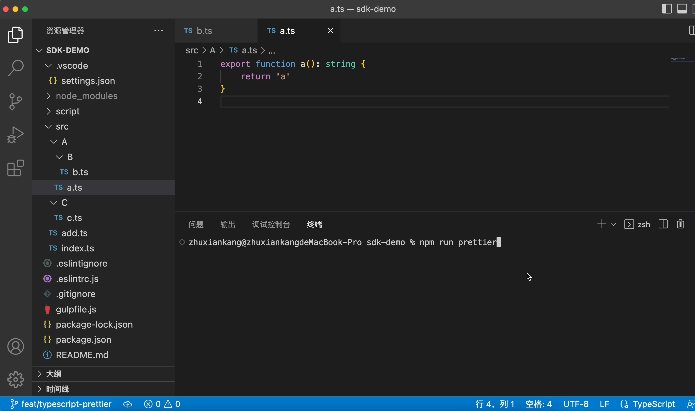
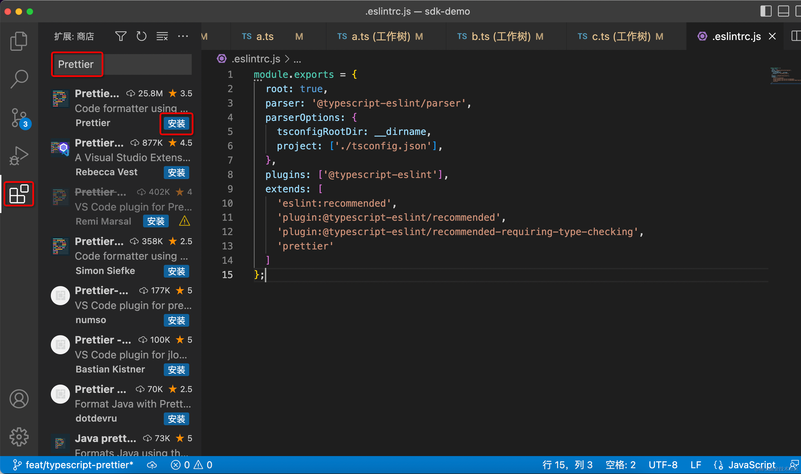
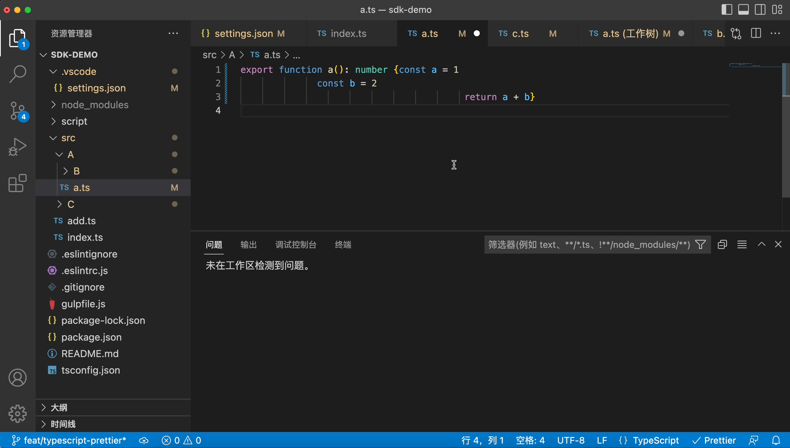
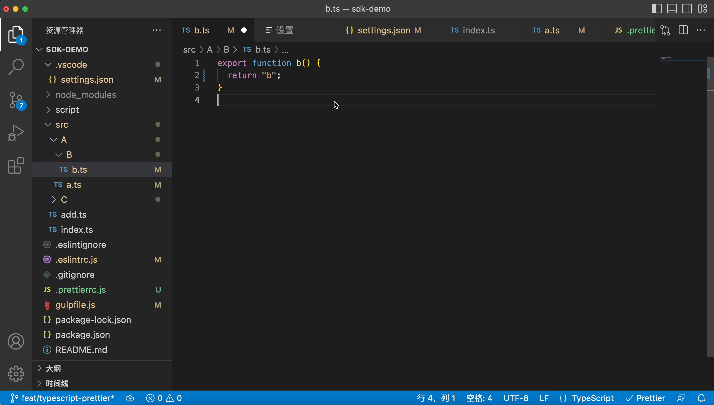

在上节课中，我们重点讲解了如何配置 ESLint，并讲解了如何使用 VS Code 进行实时检查。本节课主要讲解如何对代码进行格式校验，从而可以统一团队的代码格式。

## Prettier 和 ESLint

Prettier 是一个统一代码格式风格的工具，如果不清楚为什么需要使用 Prettier，可以查看 [Why Prettier?](https://prettier.io/docs/en/why-prettier.html)。很多人可能疑惑，ESLint 已经能够规范代码风格，为什么还需要 Prettier？在 [Prettier vs Linters](https://prettier.io/docs/en/comparison.html) 中详细说明了两者的区别，Linters 有两种类型的规则：

-   格式规则（Formatting rules）：例如 [max-len](https://eslint.org/docs/rules/max-len)、[keyword-spacing](https://eslint.org/docs/rules/keyword-spacing) 以及 [no-mixed-spaces-and-tabs](https://eslint.org/docs/rules/no-mixed-spaces-and-tabs) 等；
-   质量规则（Code-quality rules）：例如 [no-unused-vars](https://eslint.org/docs/rules/no-unused-vars)、[no-implicit-globals](https://eslint.org/docs/rules/no-implicit-globals) 以及 [prefer-promise-reject-errors](https://eslint.org/docs/rules/prefer-promise-reject-errors) 等。

ESLint 的规则校验同时包含了格式规则和质量规则，但是大部分情况下只有格式规则可以通过 `--fix` 或 VS Code 插件的 Auto Fix 功能一键修复，而质量规则更多的是发现代码可能出现的 Bug ，从而防止代码出错，这类规则往往需要手动修复。

Prettier 和 ESLint 的区别在于 Prettier 专注于统一的格式规则，从而减轻 ESLint 在格式规则上的校验，而质量规则则交给专业的 ESLint 进行处理。总结一句话就是：Prettier for formatting and linters for catching bugs!

需要注意，如果 ESLint 和 Prettier 配合使用时格式规则可能会产生冲突，在编辑器中使用 Auto Fix 功能时可能会产生混乱，此时应该让两者把各自注重的规则区分开，使用 ESLint 校验质量规则，使用 Prettier 校验格式规则。

## Prettier 配置

为了在库设计的项目中生效 Prettier，首先安装以下依赖：

``` bash
# 32.工程设计：代码格式
# eslint-config-prettier：8.7.0
npm i prettier eslint-config-prettier --save-dev
```

> 温馨提示：示例源码可以从 [demo/prettier](https://github.com/ziyi2/micro-framework/tree/demo/prettier) 分支获取。

在上节课的 ESLint 配置中，我们重点讲解了 `eslint-config` 前缀的 NPM 包是共享配置，因此这里重点查看一下的 `eslint-config-prettier` 的代码：

``` javascript
// node_modules/eslint-config-prettier
// 注意该包没有在 package.json 中配置 main 字段，默认读取目录下的 index.js 

"use strict";

const includeDeprecated = !process.env.ESLINT_CONFIG_PRETTIER_NO_DEPRECATED;

module.exports = {
  rules: {
    // The following rules can be used in some cases. See the README for more
    // information. (These are marked with 0 instead of "off" so that a
    // script can distinguish them.)
    "curly": 0,
    "lines-around-comment": 0,
    "max-len": 0,
    "no-confusing-arrow": 0,
    "no-mixed-operators": 0,
    "no-tabs": 0,
    "no-unexpected-multiline": 0,
    "quotes": 0,
    "@typescript-eslint/quotes": 0,
    "babel/quotes": 0,
    "vue/html-self-closing": 0,
    "vue/max-len": 0,
    // The rest are rules that you never need to enable when using Prettier.
    "array-bracket-newline": "off",
    // 省略默认的格式规则配置
    "@babel/object-curly-spacing": "off",
    "@babel/semi": "off",
    // 省略 typescript 的格式规则配置
    "@typescript-eslint/brace-style": "off",
    // 省略 babel 的格式规则配置
    "babel/object-curly-spacing": "off",
    // 省略 flowtype 的格式规则配置
    "flowtype/boolean-style": "off",
    // 省略 react 的格式规则配置
    "react/jsx-child-element-spacing": "off",
    // 省略 standard 的格式规则配置
    "standard/array-bracket-even-spacing": "off",
    // 省略 unicorn 的格式规则配置
    "unicorn/empty-brace-spaces": "off",
    // 省略 vue 的格式规则配置
    "vue/array-bracket-newline": "off",
    ...(includeDeprecated && {
      // Deprecated since version 4.0.0.
      // https://github.com/eslint/eslint/pull/8286
      "indent-legacy": "off",
      // Deprecated since version 3.3.0.
      // https://eslint.org/docs/rules/no-spaced-func
      "no-spaced-func": "off",
      // Deprecated since version 7.0.0.
      // https://github.com/yannickcr/eslint-plugin-react/blob/master/CHANGELOG.md#700---2017-05-06
      "react/jsx-space-before-closing": "off",
    }),
  },
};
```

可以发现 `eslint-config-prettier` 主要的作用是将大部分插件（包括`@typescript-eslint/eslint-plugin`、`eslint-plugin-babel`、`eslint-plugin-react`、`eslint-plugin-vue`、`eslint-plugin-standard`）的格式规则关闭，用于解决 ESLint 和 Prettier 配合使用时可能产生的格式规则冲突问题。通过 `eslint-config-prettier` 插件关闭可能产生冲突的格式规则：

``` javascript
// .eslintrc.js
module.exports = {
  root: true,
  parser: '@typescript-eslint/parser',
  parserOptions: {
    tsconfigRootDir: __dirname,
    project: ['./tsconfig.json'],
  },
  plugins: ['@typescript-eslint'],
  extends: [
    'eslint:recommended',
    'plugin:@typescript-eslint/recommended',
    'plugin:@typescript-eslint/recommended-requiring-type-checking',
    // 关闭 ESLint 相关的格式规则集
    // 可以省略 eslint-config 前缀
    'prettier'
  ]
};
```

配置完成后，可以通过[命令行接口](https://prettier.io/docs/en/cli.html)运行 Prettier:

``` json
  "scripts": {
    "lint": "eslint --ext .ts src",
    // 检测 src 目录下的代码，进行格式自动修复
    "prettier": "prettier src --write",
    "build": "npm run lint && node script/build.js",
    "release": "node script/publish.js"
  },
```

  


`--write` 参数类似于 ESLint 中的 `--fix`（需要谨慎使用这两个参数，推荐使用 VS Code 的 Auto Fix 功能），主要用于自动修复格式错误，例如：

``` typescript
export function a(): string {
    // 没有分号
    return 'a'
}
```

  


执行 `npm run prettier` 会自动进行格式修复：



需要注意，如果某些规则集没有对应的 `eslint-config-prettier` 关闭配置，可以先通过 [CLI helper tool](https://github.com/prettier/eslint-config-prettier#cli-helper-tool) 检测是否有重复的格式规则集在生效，然后可以通过手动配置 `eslintrc.js` 的形式进行关闭：

``` bash
# eslint-config-prettier 7.0 之前的版本
npx eslint --print-config src/index.ts | npx eslint-config-prettier-check
# eslint-config-prettier 7.0 之后的版本
npx eslint-config-prettier src/index.ts
```

例如把 `eslint-config-prettier` 在 `eslintrc.js` 中的配置去除，此时使用工具检查会发现存在重复或者冲突的格式规则：

``` bash
# 执行重复规则检查，只需要在项目中随便校验一个文件即可，除非不同文件使用不同的 ESLint 配置
npx eslint-config-prettier src/index.ts
# 打印信息
The following rules are unnecessary or might conflict with Prettier:

- @typescript-eslint/no-extra-semi
- no-mixed-spaces-and-tabs

The following rules are enabled but cannot be automatically checked. See:
https://github.com/prettier/eslint-config-prettier#special-rules

- no-unexpected-multiline
```

如果配置了 `eslint-config-prettier` 仍然存在重复或者冲突的规则，可以手动在 `eslintrc.js` 的 `rules` 中进行配规则覆盖。

## VS Code 插件

通过命令行接口 `prettier src --write` 的形式能够进行格式自动修复，但是会给人一种不可控的感觉，因为自动格式化包含了所有 `src` 目录下的文件，通常情况下格式完后，还需要通过 Git 进行代码差异对比，确保格式化不会存在问题。更推荐的方式是使用 VS Code 插件按文件进行自动格式化，可以确保开发者实时格式文件的同时，能够直接感知到当前文件的格式变化。在 VS Code 的应用商店搜索并安装 [Prettier 插件](https://marketplace.visualstudio.com/items?itemName=esbenp.prettier-vscode)：



  


使用 ESLint 匹配到相应的规则时会产生波浪线以及带颜色的文件名进行提醒，Prettier 更希望对格式规则无感知并且用户没有使用负担，因此不会在代码和文件名上产生任何提醒信息。为了可以实时格式化文件代码，需要在 VS Code 中配置 Prettier 的 Format On Save 功能：

``` json
// .vscode/settings.json
{
  // ESLint 保存自动 Fix
  "editor.codeActionsOnSave": {
    "source.fixAll": true,
  },
  // 设置 Prettier 为 VS Code 的默认格式工具
  "editor.defaultFormatter": "esbenp.prettier-vscode",
  // Prettier 保存自动格式化
  "editor.formatOnSave": true
}
```

> 温馨提示：不同版本的 Prettier 插件可能对 Format On Save 功能的配置存在差异，请以插件的官方文档为准。

此时如果在开发的过程中没有注意代码格式，例如：

``` typescript

export function a(): number {const a = 1 
              const b = 2 
                                         return a + b}
```

如果上述代码提交后需要指定开发者进行 Code Review，估计开发者内心一百个不愿意，如果具备 Fortmat On Save 功能，使用键盘上的 `Commond（Ctrl) + S` 进行保存时，代码会自动格式化：



在使用的过程中，如果想定制特殊的格式需求，可以通过在根目录新增 [Prettier 配置文件](https://prettier.io/docs/en/configuration.html)的方式进行设置，例如在根目录新增 `.prettierrc.js` 文件：

``` javascript
// .prettierrc.js
module.exports = {
  // 不使用 ; 进行结尾
  semi: false,
  // 字符串使用单引号
  singleQuote: true,
};
```

在保存时会根据配置的格式规则进行格式化：



## Prettier 确保构建

在 ESLint 确保构建中重点讲解了使用 `&&` 进行处理，从而要求在构建之前需要先通过 ESLint 校验。由于 Prettier 是轻量的格式化处理，不希望开发者进行感知，因此在真正构建的过程中可以不进行 Prettier 格式检测。

## 小结

本节课主要讲解了 Prettier 的使用。课程首先讲解了 Prettier 和 ESLint 的区别，Prettier 的主要作用是对代码格式风格进行规范统一，而 ESLint 主要作用是发现存在 Bug 隐患的代码。由于 ESLint 和 Prettier 都会存在格式规则校验，因此在课程中我们讲解了如何发现和屏蔽 ESLint 和 Prettier 的重叠规则。最后，我们讲了如何在 VS Code 中进行代码的自动格式化配置。

在下一节课程中，我们将重点讲解如何对需要提交的代码进行代码校验，从而拒绝提交不符合 ESLint 规范的代码。