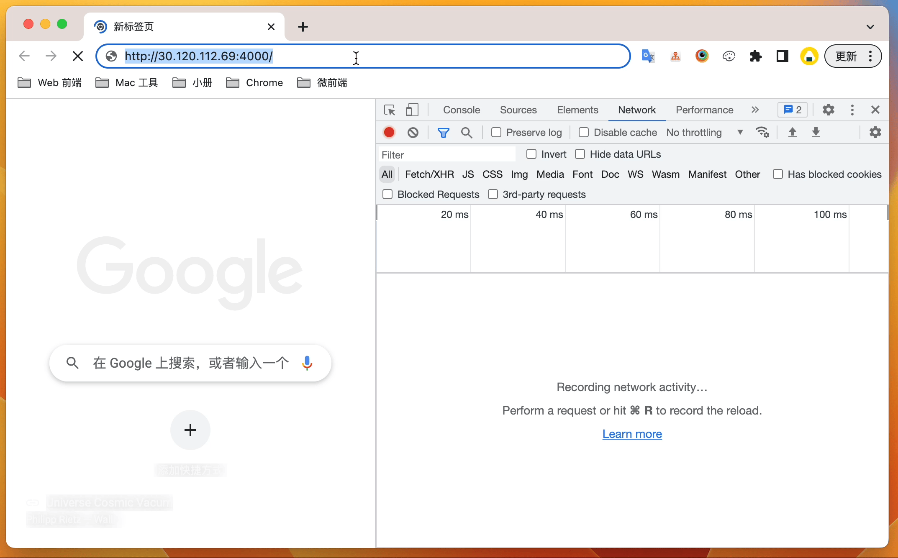

# 7.方案了解：Web Components 方案

Web Components 可以理解为浏览器的原生组件，它通过组件化的方式封装微应用，从而实现应用自治。本课程会在动态 Script 方案的基础上做少许改动来实现简单的 Web Components 方案，帮助大家快速理解该方案的优缺点。

## Web Components 方案

在动态 Script 方案的基础上进行少许改动便可以简单支持 Web Components 方案，实现思路如下所示：

-   通过请求获取后端的微应用列表数据，动态进行微应用的预获取和导航创建处理
-   根据导航进行微应用的切换，切换的过程会动态加载并执行 JS 和 CSS
-   JS 执行后会在主应用中添加微应用对应的自定义元素，从而实现微应用的加载
-   如果已经加载微应用对应的 JS 和 CSS，再次切换只需要对自定义元素进行显示和隐藏操作
-   微应用自定义元素会根据内部的生命周期函数在被添加和删除 DOM 时进行加载和卸载处理


实现效果如下所示，点击按钮后会请求微应用的静态资源并解析 JS 和 CSS：



文件的结构目录和动态 Script 保持一致，如下所示：

``` bash
├── public                  # 托管的静态资源目录
│   ├── main/               # 主应用资源目录                        
│   │   └── index.html                                        
│   └── micro/              # 微应用资源目录
│        ├── micro1.css   
│        ├── micro1.js    
│        ├── micro2.css         
│        └── micro2.js      
├── config.js                # 公共配置
├── main-server.js           # 主应用服务
└── micro-server.js          # 微应用服务
```

> 温馨提示：示例源码可以从 micro-framework 的 [demo/web-components](https://github.com/ziyi2/micro-framework/tree/demo/web-components) 分支获取。

主应用 HTML 的实现代码如下所示：

``` html
<!-- public/main/index.html -->

<!DOCTYPE html>
<html lang="en">
  <head>
    <meta charset="UTF-8" />
    <meta http-equiv="X-UA-Compatible" content="IE=edge" />
    <meta name="viewport" content="width=device-width, initial-scale=1.0" />
    <title>Document</title>
    <style>
      h1 {
        color: red;
      }
    </style>
  </head>

  <body>
    <h1>Hello，Web Components!</h1>
    <div id="nav"></div>
    <div class="container">
      <div id="micro-app-slot"></div>
    </div>

    <script type="text/javascript">
      class UtilsManager {
        constructor() {}

        getMicroApps() {
          return window
            .fetch("/microapps", {
              method: "post",
            })
            .then((res) => res.json())
            .catch((err) => {
              console.error(err);
            });
        }

        isSupportPrefetch() {
          const link = document.createElement("link");
          const relList = link?.relList;
          return relList && relList.supports && relList.supports("prefetch");
        }

        prefetchStatic(href, as) {
          if (!this.isSupportPrefetch()) {
            return;
          }
          const $link = document.createElement("link");
          $link.rel = "prefetch";
          $link.as = as;
          $link.href = href;
          document.head.appendChild($link);
        }

        loadScript({ script, id }) {
          return new Promise((resolve, reject) => {
            const $script = document.createElement("script");
            $script.src = script;
            $script.setAttribute("micro-script", id);
            $script.onload = resolve;
            $script.onerror = reject;
            document.body.appendChild($script);
          });
        }

        loadStyle({ style, id }) {
          return new Promise((resolve, reject) => {
            const $style = document.createElement("link");
            $style.href = style;
            $style.setAttribute("micro-style", id);
            $style.rel = "stylesheet";
            $style.onload = resolve;
            $style.onerror = reject;
            document.head.appendChild($style);
          });
        }
        removeStyle({ id }) {
          const $style = document.querySelector(`[micro-style=${id}]`);
          $style && $style?.parentNode?.removeChild($style);
        }

        hasLoadScript({ id }) {
          const $script = document.querySelector(`[micro-script=${id}]`);
          return !!$script;
        }

        hasLoadStyle({ id }) {
          const $style = document.querySelector(`[micro-style=${id}]`);
          return !!$style;
        }
      }
    </script>

    <script type="text/javascript">
      class MicroAppManager extends UtilsManager {
        micrpApps = [];

        constructor() {
          super();
          this.init();
        }

        init() {
          this.processMicroApps();
          this.navClickListener();
          this.hashChangeListener();
        }

        processMicroApps() {
          this.getMicroApps().then((res) => {
            this.microApps = res;
            this.prefetchMicroAppStatic();
            this.createMicroAppNav();
          });
        }

        prefetchMicroAppStatic() {
          const prefetchMicroApps = this.microApps?.filter(
            (microapp) => microapp.prefetch
          );
          prefetchMicroApps?.forEach((microApp) => {
            microApp.script && this.prefetchStatic(microApp.script, "script");
            microApp.style && this.prefetchStatic(microApp.style, "style");
          });
        }

        createMicroAppNav(microApps) {
          const fragment = new DocumentFragment();
          this.microApps?.forEach((microApp) => {
            const button = document.createElement("button");
            button.textContent = microApp.name;
            button.id = microApp.id;
            fragment.appendChild(button);
          });
          const nav = document.getElementById("nav");
          nav.appendChild(fragment);
        }

        navClickListener() {
          const nav = document.getElementById("nav");
          nav.addEventListener("click", (e) => {
            window.location.hash = event?.target?.id;
          });
        }

        hashChangeListener() {
          // Web Components 方案
          // 微应用的插槽
          const $slot = document.getElementById("micro-app-slot");

          window.addEventListener("hashchange", () => {
            this.microApps?.forEach(async (microApp) => {
              // Web Components 方案
              const $webcomponent = document.querySelector(
                `[micro-id=${microApp.id}]`
              );

              if (microApp.id === window.location.hash.replace("#", "")) {
                console.time(`fetch microapp ${microApp.name} static`);
                // 加载 CSS 样式
                microApp?.style &&
                  !this.hasLoadStyle(microApp) &&
                  (await this.loadStyle(microApp));
                // 加载 Script 标签
                microApp?.script &&
                  !this.hasLoadScript(microApp) &&
                  (await this.loadScript(microApp));
                console.timeEnd(`fetch microapp ${microApp.name} static`);

                // 动态 Script 方案
                // window?.[microApp.mount]?.("#micro-app-slot");

                // Web Components 方案
                // 如果没有在 DOM 中添加自定义元素，则先添加处理
                if (!$webcomponent) {
                  // Web Components 方案
                  // 自定义元素的标签是微应用先定义出来的，然后在服务端的接口里通过 customElement 属性进行约定
                  const $webcomponent = document.createElement(
                    microApp.customElement
                  );
                  $webcomponent.setAttribute("micro-id", microApp.id);
                  $slot.appendChild($webcomponent);
                // 如果已经存在自定义元素，则进行显示处理
                } else {
                  $webcomponent.style.display = "block";
                }
              } else {
                this.removeStyle(microApp);
                // 动态 Script 方案
                // window?.[microApp.unmount]?.();

                // Web Components 方案
                // 如果已经添加了自定义元素，则隐藏自定义元素
                if ($webcomponent) {
                  $webcomponent.style.display = "none";
                }
              }
            });
          });
        }
      }

      new MicroAppManager();
    </script>
  </body>
</html>
```

微应用的设计如下所示：

``` javascript
// micro1.js

// MDN: https://developer.mozilla.org/zh-CN/docs/Web/Web_Components
// MDN: https://developer.mozilla.org/zh-CN/docs/Web/Web_Components/Using_custom_elements
class MicroApp1Element extends HTMLElement {
  constructor() {
    super();
  }

  // [生命周期回调函数] 当 custom element 自定义标签首次被插入文档 DOM 时，被调用
  // 类似于 React 中的  componentDidMount 周期函数
  // 类似于 Vue 中的 mounted 周期函数
  connectedCallback() {
    console.log(`[micro-app-1]：执行 connectedCallback 生命周期回调函数`);
    // 挂载应用
    // 相对动态 Script，组件内部可以自动进行 mount 操作，不需要对外提供手动调用的 mount 函数，从而防止不必要的全局属性冲突
    this.mount();
  }

  // [生命周期回调函数] 当 custom element 从文档 DOM 中删除时，被调用
  // 类似于 React 中的  componentWillUnmount 周期函数
  // 类似于 Vue 中的 destroyed 周期函数
  disconnectedCallback() {
    console.log(
      `[micro-app-1]：执行 disconnectedCallback 生命周期回调函数`
    );
    // 卸载处理
    this.unmount();
  }

  mount() {
    const $micro = document.createElement("h1");
    $micro.textContent = "微应用1";
    // 将微应用的内容挂载到当前自定义元素下
    this.appendChild($micro);
  }

  unmount() {
    // 这里可以去除相应的副作用处理
  }
}

// MDN：https://developer.mozilla.org/zh-CN/docs/Web/API/CustomElementRegistry/define
// 创建自定义元素，可以在浏览器中使用 <micro-app-1> 自定义标签
window.customElements.define("micro-app-1", MicroApp1Element);
```

> 温馨提示：需要注意 Web Components 存在[浏览器兼容性问题](https://caniuse.com/?search=Web%20Components)，可以通过 [Polyfill](https://github.com/webcomponents/polyfills/tree/master/packages/webcomponentsjs) 进行浏览器兼容性处理（IE 只能兼容到 11 版本）。 

在 `main-server.js` 中增加微应用对应的自定义元素标签属性：

``` javascript
// main-server.js
import express from "express";
import path from "path";
import morgan from "morgan";
import config from "./config.js";
const app = express();
const { port, host } = config;

// 打印请求日志
app.use(morgan("dev"));

app.use(express.static(path.join("public", "main")));

app.post("/microapps", function (req, res) {
  // 这里可以是管理后台新增菜单后存储到数据库的数据
  // 从而可以通过管理后台动态配置微应用的菜单
  res.json([
    {
      // 应用名称
      name: "micro1",
      // 应用标识
      id: "micro1",
      // Web Components 方案
      // 自定义元素名称
      customElement: 'micro-app-1',
      // 应用脚本（示例给出一个脚本，多个脚本也一样）
      script: `http://${host}:${port.micro}/micro1.js`,
      // 应用样式
      style: `http://${host}:${port.micro}/micro1.css`,
      // 动态 Script 方案
      // 挂载到 window 上的加载函数 window.micro1_mount
      // mount: "micro1_mount",
      // 动态 Script 方案
      // 挂载到 window 上的卸载函数 window.micro1_unmount
      // unmount: "micro1_unmount",
      // 是否需要预获取
      prefetch: true,
    },
    {
      name: "micro2",
      id: "micro2",
      customElement: 'micro-app-2',
      script: `http://${host}:${port.micro}/micro2.js`,
      style: `http://${host}:${port.micro}/micro2.css`,
      prefetch: true,
    },
  ]);
});

// 启动 Node 服务
app.listen(port.main, host);
console.log(`server start at http://${host}:${port.main}/`);
```

对比动态 Script 的方案可以发现 Web Components 的优势如下所示：

-   复用性：不需要对外抛出加载和卸载的全局 API，可复用能力更强
-   标准化：W3C 的标准，未来能力会得到持续升级（说不定支持了 JS 上下文隔离）
-   插拔性：可以非常便捷的进行移植和组件替换

当然使用 Web Components 也会存在一些劣势，例如：

-   兼容性：对于 IE 浏览器不兼容，需要通过 Polyfill 的方式进行处理
-   学习曲线：相对于传统的 Web 开发，需要掌握新的概念和技术

## 小结

本文主要讲解了 Web Components 方案的简单实现示例，Web Components 本身属于 W3C 的标准，符合微前端技术无关的特性，未来可以跟随浏览器进行升级和维护，这也是大多数微前端框架选择 Web Components 进行设计的重要原因。当然，在使用 Web Components 进行设计时也需要考虑一些副作用，例如浏览器兼容性。课程到这里，想必大家对于微前端的一些技术方案有了一定了解，在接下来的课程中，我们会重点讲解微前端中 Cookie 相关的知识点。