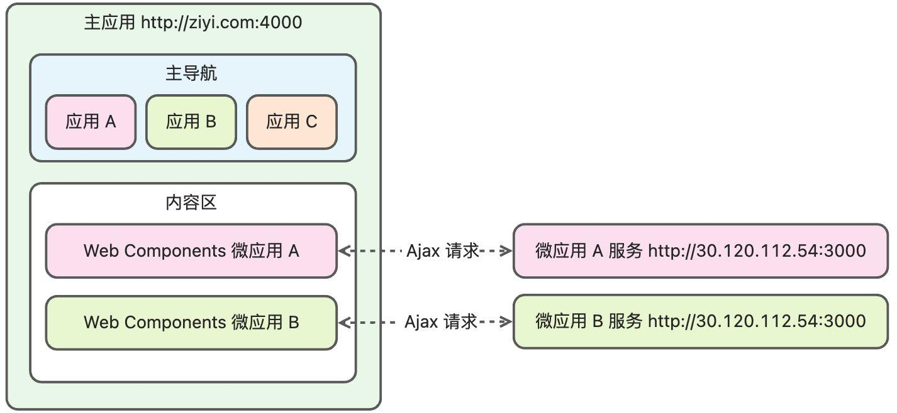
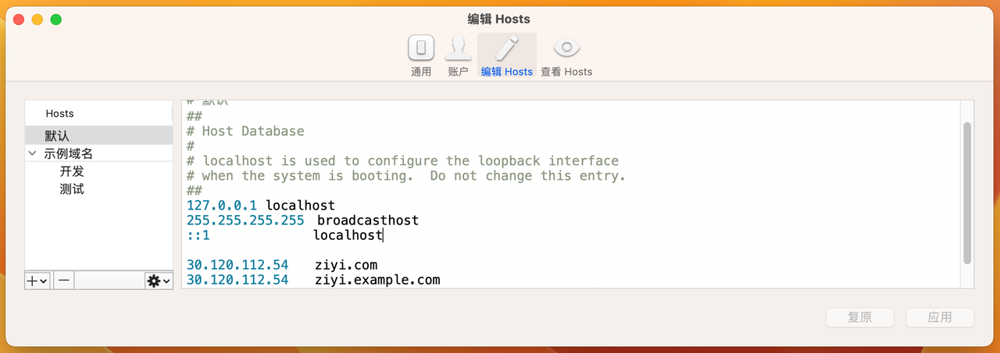
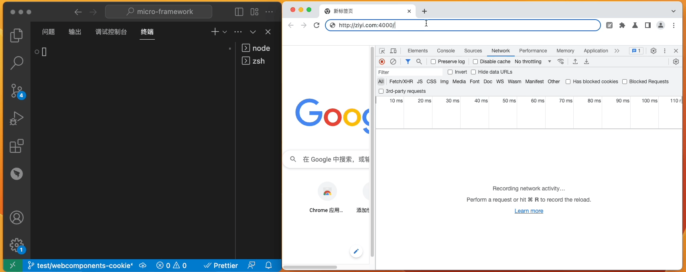
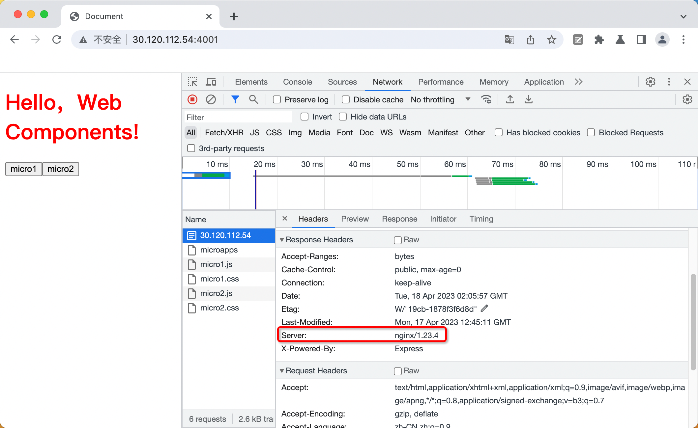
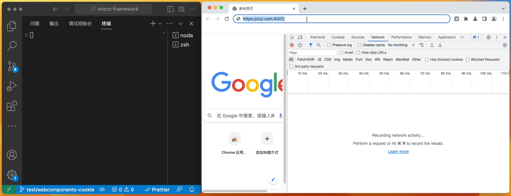

上一节课我们讲解了 iframe 中的 Cookie 携带情况，本课程以 Web Componets 为例讲解 Ajax 请求中的 Cookie 处理。在 Web Componets 方案中，虽然主子应用处于同一个 Host 地址，但是子应用的服务端此时可能有自己的服务端，因此可以重点查看一下 Ajax 请求在跨域时的 Cookie 携带情况：



> 温馨提示：上述情况是否有方法可以使微应用 A 和 B 不产生跨域请求？

回顾一下 Web Componets 的微前端示例，目录结构如下所示：

``` bash
├── public                  # 托管的静态资源目录
│   ├── main/               # 主应用资源目录                        
│   │   └── index.html                                        
│   └── micro/              # 微应用资源目录
│        ├── micro1.css   
│        ├── micro1.js    
│        ├── micro2.css         
│        └── micro2.js      
├── config.js               # 公共配置
├── main-server.js          # 主应用服务
└── micro-server.js         # 微应用服务
```

> 温馨提示：示例源码可以从 micro-framework 的 [demo/web-components-cookie](https://github.com/ziyi2/micro-framework/tree/demo/web-components-cookie) 分支获取。

为了模拟跨域的 Ajax 请求情况，可以使用 iHosts 进行域名映射，我们希望实现如下功能：


-   在主应用中使用 iHosts 进行域名映射，将 `ziyi.com` 映射到本地 IP 地址
-   子应用仍然保留原来的 IP 地址访问，从而和主应用形成跨域和跨站

iHosts 的配置保持不变，`ziyi.com` 可以映射到本地的 IP 地址：



在之前方案的基础上，使微应用新增跨站的 Ajax 请求：

``` javascript
// micro1.js
// micro2.js 同理
class MicroApp1Element extends HTMLElement {
  constructor() {
    super();
  }
  
  connectedCallback() {
    console.log(`[micro-app-1]：执行 connectedCallback 生命周期回调函数`);
    this.mount();
  }

  disconnectedCallback() {
    console.log(`[micro-app-1]：执行 disconnectedCallback 生命周期回调函数`);
    this.unmount();
  }

  mount() {
    const $micro = document.createElement("h1");
    $micro.textContent = "微应用1";
    this.appendChild($micro);

    // 新增 Ajax 请求，用于请求子应用服务
    // 需要注意 micro1.js 动态加载在主应用 ziyi.com:4000 下，因此是跨站请求
    
    // 如果先发起 micro1.js 的 Ajax 请求，希望可以响应子应用服务端的 Cookie
    // 再次发起 micro2.js 的同地址的 Ajax 请求，此时希望请求头中可以携带 Cookie
    // 这种情况可用于登录态的免登 Cookie 设计
    window
      .fetch("http://30.120.112.54:3000/cors", {
        method: "post",
        // 允许在请求时携带 Cookie
        // https://developer.mozilla.org/zh-CN/docs/Web/API/Request/credentials
        credentials: "include"
      })
      .then((res) => res.json())
      .then(() => {})
      .catch((err) => {
        console.error(err);
      });
  }

  unmount() {}
}

window.customElements.define("micro-app-1", MicroApp1Element);
```

为了使得微应用可以支持跨站请求，需要在服务端进行额外的跨域配置，如下所示：

``` javascript
// main-server.js
import express from "express";
import path from "path";
import morgan from "morgan";
import config from "./config.js";
import cookieParser from "cookie-parser";
const app = express();
const { port, host } = config;

// 打印请求日志
app.use(morgan("dev"));

// cookie 中间件
app.use(cookieParser());

app.use(express.static(path.join("public", "main")));

app.post("/microapps", function (req, res) {

  console.log("main cookies: ", req.cookies);

  // 设置一个响应的 Cookie 数据
  res.cookie("main-app", true);

  res.json([
    {
      name: "micro1",
      id: "micro1",
      customElement: "micro-app-1",
      script: `http://${host}:${port.micro}/micro1.js`,
      style: `http://${host}:${port.micro}/micro1.css`,
      prefetch: true,
    },
    {
      name: "micro2",
      id: "micro2",
      customElement: "micro-app-2",
      script: `http://${host}:${port.micro}/micro2.js`,
      style: `http://${host}:${port.micro}/micro2.css`,
      prefetch: true,
    },
  ]);
});

app.listen(port.main, host);
console.log(`server start at http://${host}:${port.main}/`);


// micro-server.js
import express from "express";
import morgan from "morgan";
import path from "path";
import cookieParser from "cookie-parser";
import config from "./config.js";
const app = express();
const { port, host } = config;

app.use(morgan("dev"));

// cookie 中间件
app.use(cookieParser());

// 设置支持跨域请求头
// 示例设置了所有请求的跨域配置，也可以对单个请求进行跨域设置
app.use((req, res, next) => {
  // 跨域请求中涉及到 Cookie 信息传递时值不能为 *，必须是具体的主应用地址
  // 这里的 ziyi.com 使用 iHosts 映射到本地 IP 地址
  res.header("Access-Control-Allow-Origin", `http://ziyi.com:${port.main}`);
  res.header("Access-Control-Allow-Methods", "GET, POST, OPTIONS");
  res.header("Allow", "GET, POST, OPTIONS");
  // 允许跨域请求时携带 Cookie
  // https://developer.mozilla.org/zh-CN/docs/Web/HTTP/Headers/Access-Control-Allow-Credentials
  res.header("Access-Control-Allow-Credentials", true);
  next();
});

app.use(
  express.static(path.join("public", "micro"), {
    etag: true,
    lastModified: true,
  })
);

app.post("/cors", function (req, res) {

  // 打印子应用的 Cookie 携带情况
  console.log("micro cookies: ", req.cookies);

  // 设置一个响应的 Cookie 数据
  res.cookie("micro-app", true);
  res.json({
    hello: "true",
  });
});

app.listen(port.micro, host);
console.log(`server start at http://${host}:${port.micro}/`);
```

启动主应用和子应用的服务进行 Ajax 请求用于观察是否携带 Cookie ，如下所示：



在上述示例中，我们得到如下结果：

-   主应用服务端成功设置 Cookie，再次刷新页面时前端的请求会自动携带上 Cookie 信息（观察服务端的 Cookie 打印信息）
-   子应用进行跨域请求时无法成功设置 Cookie

在上述示例中，我们希望两个微应用的第一次 Ajax 请求可以响应服务端的 Cookie 信息，而第二次的 Ajax 请求可以携带第一次 Ajax 请求响应的 Cookie 信息，但是通过测试发现第二次 Ajax 请求并没有携带 Cookie 信息，设置 Cookie 的警告信息基本上和 iframe 中的跨站相同：This Set-Cookie didn't specify a "SameSite" attribute and was default to "SameSite=Lax"， and was blocked because it came from a cross-site response which was not the response to a top-level navigation. The Set-Cookie had to have been set with "SameSite=None" to enable cross-site usage. This Set-Cookie was blocked because it had the "Secure" attribute but was not received over a secure connection. This Set-Cookie was blocked because it was not sent over a secure-connection and would have overwritten a cookie with Secure attribute.

  


这里和 iframe 方案中的跨站情况类似，需要设置 Cookie 的 SameSite 和 Secure 属性并修改成 HTTPS 协议。为了支持 HTTPS 协议，除了使用 iframe 示例中的 Ngrok，最基本的方式是提供 Nginx 反向代理，在这里可以设置一个反向代理的方案，如下所示：


-   在主应用中使用 iHosts 进行域名映射，将 `ziyi.com` 映射到本地 IP 地址，映射完成后进行 Nginx 反向代理，使其支持 HTTPS 协议
-   子应用和主应用跨站，为了支持 HTTPS 协议，也需要进行 Nginx 反向代理

为了使用 Nginx 进行反向代理，首先需要使用 Homebrew 进行安装：

``` bash
# 9.方案了解：Ajax Cookie
brew install nginx

# 安装信息省略
# ...
# 打印
Docroot is: /opt/homebrew/var/www

# 打印信息告知 nginx 的配置文件地址，注意修改该配置后需要重启 nginx 服务
The default port has been set in /opt/homebrew/etc/nginx/nginx.conf to 8080 so that
nginx can run without sudo.

nginx will load all files in /opt/homebrew/etc/nginx/servers/.

To restart nginx after an upgrade:
  # 打印信息告知在后台重启 Nginx 服务的执行命令
  brew services restart nginx
Or, if you don't want/need a background service you can just run:
  /opt/homebrew/opt/nginx/bin/nginx -g daemon off;
==> Summary
🍺  /opt/homebrew/Cellar/nginx/1.23.4: 26 files, 2.2MB
==> Running `brew cleanup nginx`...
Disable this behaviour by setting HOMEBREW_NO_INSTALL_CLEANUP.
Hide these hints with HOMEBREW_NO_ENV_HINTS (see `man brew`).
==> Caveats
==> nginx
Docroot is: /opt/homebrew/var/www

The default port has been set in /opt/homebrew/etc/nginx/nginx.conf to 8080 so that
nginx can run without sudo.

nginx will load all files in /opt/homebrew/etc/nginx/servers/.

To restart nginx after an upgrade:
  brew services restart nginx
Or, if you don't want/need a background service you can just run:
  /opt/homebrew/opt/nginx/bin/nginx -g daemon off;
```

  


安装后可以简单进行 Nginx 反向代理的测试，这里尝试使用 4001 端口代理主应用的 4000 端口，需要修改 Nginx 的配置并重新启动 Nginx 服务。从打印信息知道配置文件在 `/opt/homebrew/etc/nginx/nginx.conf` 中，打开配置文件进行简单的代理配置：

``` bash
#user  nobody;
worker_processes  1;

#error_log  logs/error.log;
#error_log  logs/error.log  notice;
#error_log  logs/error.log  info;

#pid        logs/nginx.pid;

events {
    worker_connections  1024;
}

http {
    include       mime.types;
    default_type  application/octet-stream;

    #log_format  main  '$remote_addr - $remote_user [$time_local] "$request" '
    #                  '$status $body_bytes_sent "$http_referer" '
    #                  '"$http_user_agent" "$http_x_forwarded_for"';

    #access_log  logs/access.log  main;

    sendfile        on;
    #tcp_nopush     on;

    #keepalive_timeout  0;
    keepalive_timeout  65;

    #gzip  on;

    server {
        # 设置主应用的代理端口为 4001
        listen       4001;
        server_name  localhost;

        #charset koi8-r;

        #access_log  logs/host.access.log  main;

        location / {
            # root   html;
            # index  index.html index.htm;
            # 代理到主应用的 Node 地址
            proxy_pass 'http://30.120.112.54:4000'
        }

        #error_page  404              /404.html;

        # redirect server error pages to the static page /50x.html
        #
        error_page   500 502 503 504  /50x.html;
        location = /50x.html {
            root   html;
        }

        # proxy the PHP scripts to Apache listening on 127.0.0.1:80
        #
        #location ~ .php$ {
        #    proxy_pass   http://127.0.0.1;
        #}

        # pass the PHP scripts to FastCGI server listening on 127.0.0.1:9000
        #
        #location ~ .php$ {
        #    root           html;
        #    fastcgi_pass   127.0.0.1:9000;
        #    fastcgi_index  index.php;
        #    fastcgi_param  SCRIPT_FILENAME  /scripts$fastcgi_script_name;
        #    include        fastcgi_params;
        #}

        # deny access to .htaccess files, if Apache's document root
        # concurs with nginx's one
        #
        #location ~ /.ht {
        #    deny  all;
        #}
    }

    # another virtual host using mix of IP-, name-, and port-based configuration
    #
    #server {
    #    listen       8000;
    #    listen       somename:8080;
    #    server_name  somename  alias  another.alias;

    #    location / {
    #        root   html;
    #        index  index.html index.htm;
    #    }
    #}

    # HTTPS server
    #
    #server {
    #    listen       443 ssl;
    #    server_name  localhost;

    #    ssl_certificate      cert.pem;
    #    ssl_certificate_key  cert.key;

    #    ssl_session_cache    shared:SSL:1m;
    #    ssl_session_timeout  5m;

    #    ssl_ciphers  HIGH:!aNULL:!MD5;
    #    ssl_prefer_server_ciphers  on;

    #    location / {
    #        root   html;
    #        index  index.html index.htm;
    #    }
    #}
    include servers/*;
}
```

  


需要注意在重新启动 Nginx 服务之前，可以先进行配置检查，如下所示：

``` bash
# 执行检查
sudo nginx -t
# 打印信息
nginx: [emerg] unexpected "}" in /opt/homebrew/etc/nginx/nginx.conf:56
nginx: configuration file /opt/homebrew/etc/nginx/nginx.conf test failed
```

一般遇到上述情况主要是 `}` 的上一行出现问题 ，仔细观察发现上一行没有以 `;` 结尾：

``` bash
location / {
    # root   html;
    # index  index.html index.htm;
    # 代理到主应用的地址，结尾处增加分号 ；
    proxy_pass 'http://30.120.112.54:4000';
}
```

重新进行 Nginx 配置的检测：

``` bash
# 执行
sudo nginx -t
# 打印
nginx: the configuration file /opt/homebrew/etc/nginx/nginx.conf syntax is ok
nginx: configuration file /opt/homebrew/etc/nginx/nginx.conf test is successful
```

此时可以使用 brew 提供的命令在后台重新启动 Nginx 服务：

``` bash
# 使用 brew 推荐的 nginx 重启命令
# 建议使用 Nginx 自带的命令，如果遇到代理失败，建议杀掉 Nginx 进程重新尝试
brew services restart nginx

# 打印
Stopping `nginx`... (might take a while)
==> Successfully stopped `nginx` (label: homebrew.mxcl.nginx)
==> Successfully started `nginx` (label: homebrew.mxcl.nginx)
```

启动成功后可以通过 4001 端口进行访问，发现代理成功：



接下来我们需要将 HTTP 协议改成 HTTPS 协议进行访问，为了在开发态支持 HTTPS 协议，可以使用 [mkcert](https://github.com/FiloSottile/mkcert) 生成本地 CA 证书：

``` bash
# 安装 mkcert
brew install mkcert

# 执行以下命令，生成本地 CA 证书
# 进入项目目录
# mkcert example.com "*.example.com" example.test localhost 127.0.0.1 ::1
mkcert ziyi.com 30.120.112.54 localhost 127.0.0.1 ::1

# 打印信息
# ziyi.com 会在 iHosts 中进行 IP 映射
Created a new certificate valid for the following names 📜
 - "ziyi.com"
 - "30.120.112.54"
 - "localhost"
 - "127.0.0.1"
 - "::1"

The certificate is at "./ziyi.com+4.pem" and the key at "./ziyi.com+4-key.pem" ✅

It will expire on 19 July 2025 🗓
```

> 温馨提示：可以额外了解一下本地 CA 证书和自签名证书的区别？

生成本地的 CA 证书后将 Niginx 的配置进行 HTTPS 更改（Nginx 配置文件提供了示例，打开注释进行配置即可）：

``` bash
#user  nobody;
worker_processes  1;

#error_log  logs/error.log;
#error_log  logs/error.log  notice;
#error_log  logs/error.log  info;

#pid        logs/nginx.pid;

events {
    worker_connections  1024;
}

http {
    include       mime.types;
    default_type  application/octet-stream;

    #log_format  main  '$remote_addr - $remote_user [$time_local] "$request" '
    #                  '$status $body_bytes_sent "$http_referer" '
    #                  '"$http_user_agent" "$http_x_forwarded_for"';

    #access_log  logs/access.log  main;

    sendfile        on;
    #tcp_nopush     on;

    #keepalive_timeout  0;
    keepalive_timeout  65;

    #gzip  on;

    # server {
    #     # 设置主应用的代理端口为 4001
    #     listen       4001;
    #     server_name  localhost;

    #     #charset koi8-r;

    #     #access_log  logs/host.access.log  main;

    #     location / {
    #         # root   html;
    #         # index  index.html index.htm;
    #         # 代理到主应用的地址
    #         proxy_pass 'http://30.120.112.54:4000';
    #     }

    #     #error_page  404              /404.html;

    #     # redirect server error pages to the static page /50x.html
    #     #
    #     error_page   500 502 503 504  /50x.html;
    #     location = /50x.html {
    #         root   html;
    #     }

    #     # proxy the PHP scripts to Apache listening on 127.0.0.1:80
    #     #
    #     #location ~ .php$ {
    #     #    proxy_pass   http://127.0.0.1;
    #     #}

    #     # pass the PHP scripts to FastCGI server listening on 127.0.0.1:9000
    #     #
    #     #location ~ .php$ {
    #     #    root           html;
    #     #    fastcgi_pass   127.0.0.1:9000;
    #     #    fastcgi_index  index.php;
    #     #    fastcgi_param  SCRIPT_FILENAME  /scripts$fastcgi_script_name;
    #     #    include        fastcgi_params;
    #     #}

    #     # deny access to .htaccess files, if Apache's document root
    #     # concurs with nginx's one
    #     #
    #     #location ~ /.ht {
    #     #    deny  all;
    #     #}
    # }

    # another virtual host using mix of IP-, name-, and port-based configuration
    #
    #server {
    #    listen       8000;
    #    listen       somename:8080;
    #    server_name  somename  alias  another.alias;

    #    location / {
    #        root   html;
    #        index  index.html index.htm;
    #    }
    #}

    # HTTPS server
    # 使用 HTTPS 协议，代理到主应用
    server {
       listen       4001 ssl;
       server_name  localhost;

       ssl_certificate      /Users/zhuxiankang/Desktop/Github/micro-framework/ziyi.com+4.pem;
       ssl_certificate_key  /Users/zhuxiankang/Desktop/Github/micro-framework/ziyi.com+4-key.pem;
       
       ssl_session_cache    shared:SSL:1m;
       ssl_session_timeout  5m;

       ssl_ciphers  HIGH:!aNULL:!MD5;
       ssl_prefer_server_ciphers  on;

       location / {
        #    root   html;
        #    index  index.html index.htm;
        proxy_pass 'http://30.120.112.54:4000';
       }
    }

    # HTTPS server
    # 使用 HTTPS 协议，代理到微应用
    server {
       listen       3001 ssl;
       server_name  localhost;
       
       ssl_certificate      /Users/zhuxiankang/Desktop/Github/micro-framework/ziyi.com+4.pem;
       ssl_certificate_key  /Users/zhuxiankang/Desktop/Github/micro-framework/ziyi.com+4-key.pem;

       ssl_session_cache    shared:SSL:1m;
       ssl_session_timeout  5m;

       ssl_ciphers  HIGH:!aNULL:!MD5;
       ssl_prefer_server_ciphers  on;

       location / {
        #    root   html;
        #    index  index.html index.htm;
        proxy_pass 'http://30.120.112.54:3000';
       }
    }
    include servers/*;
}
```

更改服务端代码和前端代码（前端代码不再展示，只需要更改请求的地址即可）：

``` javascript
// main-server.js
import express from "express";
import path from "path";
import morgan from "morgan";
import config from "./config.js";
import cookieParser from "cookie-parser";
const app = express();
const { port, host } = config;

app.use(morgan("dev"));

// cookie 中间件
app.use(cookieParser());

app.use(express.static(path.join("public", "main")));

app.post("/microapps", function (req, res) {
    
  // 再次刷新页面时观察 Cookie 的携带情况
  console.log("main cookies: ", req.cookies);

  // 设置一个响应的 Cookie 数据
  res.cookie("main-app", true);

  res.json([
    {
      name: "micro1",
      id: "micro1",
      customElement: "micro-app-1",
      // 更改微应用资源的加载地址，使用 Nginx 的代理地址
      script: `https://${host}:3001/micro1.js`,
      style: `https://${host}:3001/micro1.css`,
      prefetch: true,
    },
    {
      name: "micro2",
      id: "micro2",
      customElement: "micro-app-2",
      script: `https://${host}:3001/micro2.js`,
      style: `https://${host}:3001/micro2.css`,
      prefetch: true,
    },
  ]);
});

// 启动 Node 服务
app.listen(port.main, host);
console.log(`server start at http://${host}:${port.main}/`);


// micro-server.js
import express from "express";
import morgan from "morgan";
import path from "path";
import cookieParser from "cookie-parser";
import config from "./config.js";
const app = express();
const { port, host } = config;

app.use(morgan("dev"));

// cookie 中间件
app.use(cookieParser());

app.use((req, res, next) => {
  // 跨域请求中涉及到 Cookie 信息传递，值不能为 *，必须是具体的地址信息
  // 跨域白名单配置为主应用的 Nginx 代理地址
  res.header("Access-Control-Allow-Origin", `https://ziyi.com:4001`);
  res.header("Access-Control-Allow-Methods", "GET, POST, OPTIONS");
  res.header("Allow", "GET, POST, OPTIONS");
  // 允许客户端发送跨域请求时携带 Cookie
  res.header("Access-Control-Allow-Credentials", true);
  next();
});

app.use(
  express.static(path.join("public", "micro"), {
    etag: true,
    lastModified: true,
  })
);

app.post("/cors", function (req, res) {
    
  // 用于观察二次请求时的 Cookie 的携带情况
  console.log('micro cookies: ', req.cookies);

  // 增加 SameSite 和 Secure 属性，从而使浏览器支持 iframe 子应用的跨站携带 Cookie
  // 注意 Secure 需要 HTTPS 协议的支持
  const cookieOptions = { sameSite: "none", secure: true };
  // 设置一个响应的 Cookie 数据
  res.cookie("micro-app", true, cookieOptions);
  res.json({
    hello: "true",
  });
});

app.listen(port.micro, host);
console.log(`server start at http://${host}:${port.micro}/`);
```

启动主应用和子应用的服务后可以重点观察 Cookie 的携带情况，如下所示：



在上述示例中，我们得到如下结果：

-   主应用服务端成功设置 Cookie，再次刷新页面时前端的请求会自动携带上 Cookie 信息（观察服务端的 Cookie 打印信息）
-   Chrome 浏览器采用跨域 Ajax 请求进行设计时，默认无法携带 Cookie，需要使用 HTTPS 协议和服务端 Cookie 属性（SameSite 和 Secure）设置才行

## 小结

  


在 Web Components 的 Ajax 请求示例中，我们发现跨站的情况下和 iframe 方案情况相似，需要服务端进行 Cookie 配置和跨域支持，除此之外，在前端的 Ajax 请求中还要配置允许携带 Cookie 的属性 `credentials`。