# 第14章—Web控件UI颜色的定制：accent-color和color-scheme

Web 开发者都有一个共识，要给 Web 控件（一般是 HTML 表单元素）定制 UI 风格较为困难。很多时候，开发者都是通过别的方式绕开原生表单控件，比如使用非表单元素来模拟表单控件，或者重置表单控件样式并从头开始构建。这样做的唯一目的，就是让表单控件的 UI 风格在各平台上一致。但是，这给我们增加了很多额外的工作量，而且也会导致表单控件元素状态的样式被丢弃，以及内置的可访问性功能丧失。也就是说，要完全重现浏览器提供的功能，可能比你想象中要承担的工作多得多。


如果，直接有相应的 CSS 属性让开发者操作表单控件 UI，事情就会简单多了，开发者也可以从此避开非表单控件元素，让表单控件更具个性化 UI。虽然目前我们还无法直接做到这一点，但 CSS 在这方面做出了很多的改变。比如说，我们现在可以直接使用 CSS 来控制表单元素的重点颜色（Accent Color），一种典型的明亮的颜色。这也就是我们今天要介绍的 CSS 的 `accent-color` 属性！

## accent-color 的简介

`accent-color` 属性是 [CSS UI 规范](https://www.w3.org/TR/css-ui-4)（CSS Basic User Interface Module Level 4 ）中 [“美化控件”（Styling Widgets）](https://www.w3.org/TR/css-ui-4/#styling-widgets)中的一个属性。早在 2021 年就得到部分主流浏览器的支持。`accent-color` 允许你仅写一行 CSS 代码，就可以将你的品牌色运用于表单控件上，使你免于自定义工作。

简单地说，`accent-color` 可以用来设置表单控件的高亮色（即着重色），并且可以让支持的终端达到一致的效果：

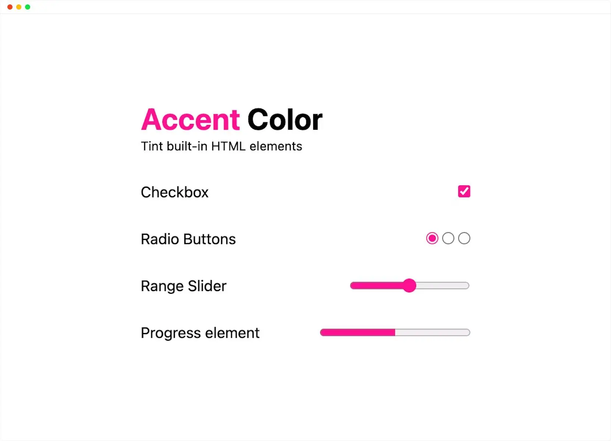

## accent-color 的使用

`accent-color` 的使用非常简单，只需下面这几行代码，就可以定制化表单的控件颜色（着重色）：

```CSS
:root {
    --brand-color: deeppink;
    accent-color: var(--brand-color);
}

@media (prefers-color-scheme: dark) {
    :root {
        --brand-color: hsl(328 100% 65%);
    }
}
```

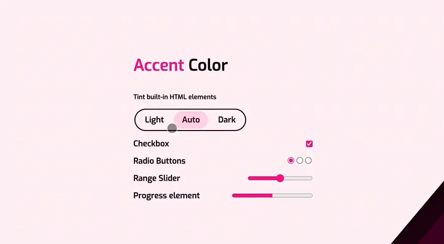

> Demo 地址：<https://codepen.io/airen/full/JjmVQZv>

上面示例展示了 `accent-color` 属性和 `color-scheme` 属性一起使用的效果，允许开发者同时给亮色和深色模式下的表单控件元素着色。当用户激活了深色主题，页面使用  `color-scheme: light dark` ，并使用 `hsl(328 100% 65%)` 作为深色主题的热粉色着色控件。

通过上面的示例，我们对 `accent-color` 有了一个初体验。接下来，花点时间探讨 `accent-color`属性。

[CSS 规范是这样描述 accent-color 属性的](https://www.w3.org/TR/css-ui-4/#widget-accent)：

> The accent-color CSS property allows the author to specify the accent color for user-interface controls generated by the element.

大致意思是：“**`accent-color`** **属性允许开发者为该元素生成的用户界面控件指定重音色（高亮色）**”。`accent-color` 属性主要接受两个值，其一是关键词 `auto` ，也是 `accent-color` 属性的默认值，代表一个 UA （比如浏览器）选择的颜色，如果有的话，它应该与平台的重点颜色（着重色）相匹配。也就是说，表单控件的重点颜色会根据客户端来着色。如下图所示：

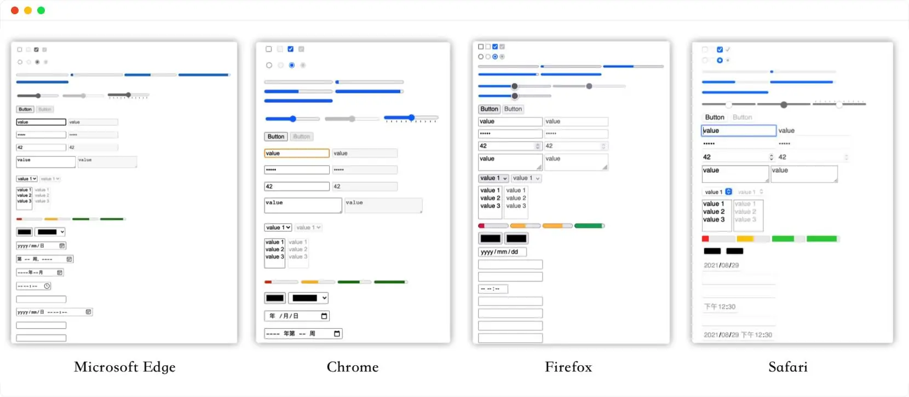

`accent-color` 属性的另一个值是 `<color>` ，即 CSS 颜色中指定的值。当 `accent-color` 的值为 `<color>` 值时，表示指定用作强调色的颜色：

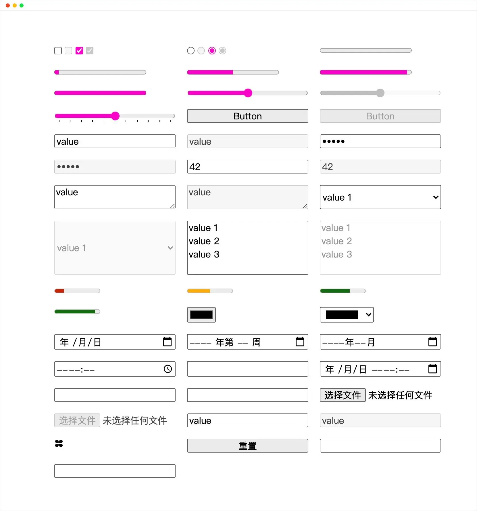

## 可用 accent-color 的元素

HTML中定义了很多种不同类型的[表单控件](https://www.w3.org/TR/html52/sec-forms.html#form-categories)，比如我们熟悉的 `<input>`、`<select>` 和 `<textarea>`等：

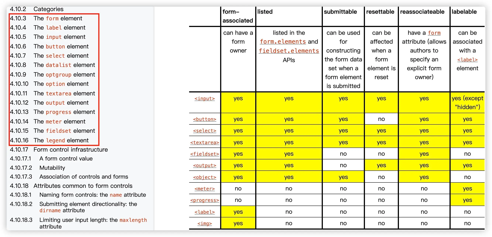

但到目前为止，只有四种表单控件可以通过 `accent-color` 属性对控件高亮颜色进行着色。这四种类型表单控件分别是：

*   [复选框](https://www.w3.org/TR/html52/sec-forms.html#checkbox-state-typecheckbox)（`<input type="checkbox" ``/>`）
*   [单选按钮](https://www.w3.org/TR/html52/sec-forms.html#radio-button-state-typeradio)（`<input type="radio" />`）
*   [滑块](https://www.w3.org/TR/html52/sec-forms.html#range-state-typerange)（`<input type="range" />`）
*   [进度条](https://www.w3.org/TR/html52/sec-forms.html#the-progress-element)（`<progress />`）

另外，[@Adam Argyle 提供了常见表单控件使用 accent-color 属性测试用例](https://accent-color.glitch.me/)，在这个测试用例中，支持 `accent-color` 的控件可以看到重点颜色不再是系统默认的，比如 `accent-color` 的值为 `rgb(255 0 210)`时效果：

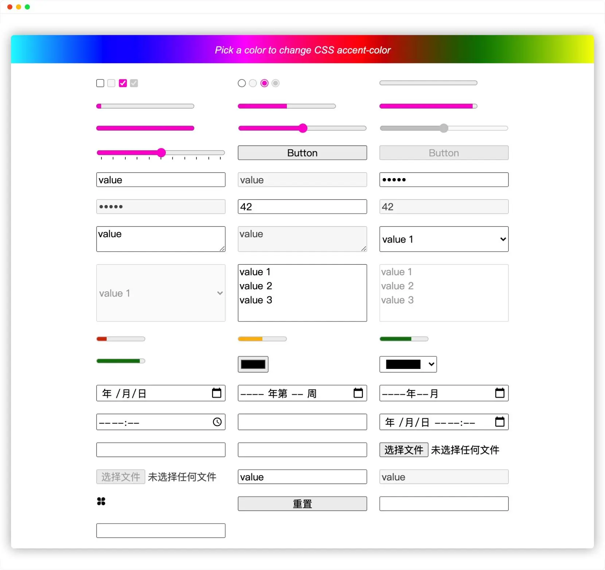

[我把示例搬到 Codepen 上](https://codepen.io/airen/full/poxBMvw)，并将 HTML 常见的表单控件都已添加。也就是说，该示例能更全面地检测已支持 `accent-color` 属性的表单元素：

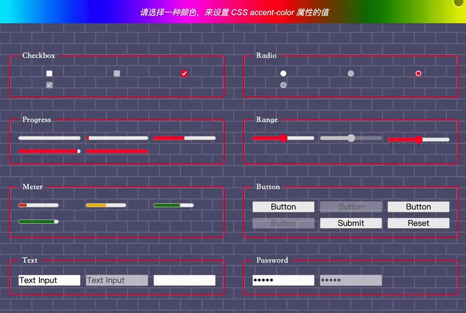

> Demo 地址：<https://codepen.io/airen/full/poxBMvw>

再来看一个简单的示例，使用 `accent-color` 和 `color-theme` ，为**复选框**、**单选按钮**、**滑块**和**进度条**在亮色和暗色模式下设置不同的高亮着色：

```CSS
.accented { 
    accent-color: deeppink; 
} 

[color-scheme="dark"] .accented { 
    accent-color: hsl(328 100% 80%); 
} 

[color-scheme="light"] { 
    color-scheme: light; 
} 

[color-scheme="dark"] { 
    color-scheme: dark; 
} 

fieldset[color-scheme="dark"] { 
    background: Canvas; 
    color: CanvasText; 
}
```

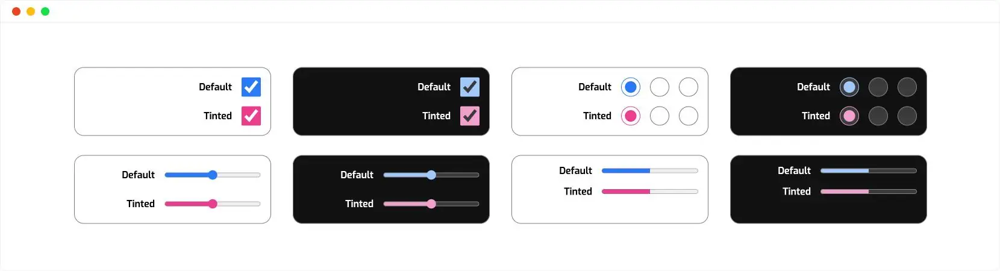

> Demo 地址：<https://codepen.io/airen/full/QWZPegM>

注意，上面这个示例，你还可以使用 CSS 的 `:has()` 选择器、样式查询和媒体查询，实现带交互效果的暗黑模式下表单控件强调色（着重色）：

```CSS
:where(html) {
    --darkmode: 0;
    container-name: root;
    container-type: normal;
    color-scheme: light dark;
}

body {
    --brand-color: deeppink;
}


@media (prefers-color-scheme：dark) {
    body {
        --brand-color: hsl(328 100% 80%);
    }
}

@media (prefers-color-scheme: dark) {
    html {
        --darkmode: 1;
        color-scheme: dark;
    }
}

@media (prefers-color-scheme: light) {
    html {
        --darkmode: 0;
    }
}

html:has(#color-scheme-light:checked) {
    --darkmode: 0;
}
html:has(#color-scheme-dark:checked) {
    --darkmode: 1;
}


@container root style(--darkmode: 1) {
    body {
        --brand-color: hsl(328 100% 80%);
    }
}


body {
    color-scheme: light dark;
    accent-color: var(--brand-color);
}
```

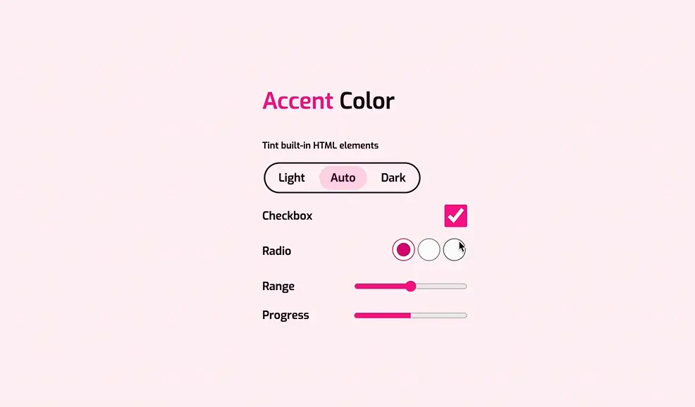

> Demo 地址：<https://codepen.io/airen/full/OJBGKxb>

## 给更多的元素设置着重色

你可能会想，有没有办法为更多控件设置着重色。值得庆幸的是，确实有一些方法可以。比如，我们可以给**焦点环** 、**选中文本高亮** 、**列表标记（****`::marker`****）** 、**箭头指示器** （仅Webkit）和**滚动条指示器** （仅Firefox）添加着重色：

```CSS
html { 
    --color-accent: hotpink; 
    scrollbar-color: hotpink Canvas; 
} 

:root { 
    accent-color: var(--color-accent); 
} 

:focus-visible { 
    outline-color: var(--color-accent); 
} 

::selection { 
    background-color: var(--color-accent); 
} 

::marker { 
    color: var(--color-accent); 
} 

::-webkit-calendar-picker-indicator {
    color: var(--color-accent);
}

::-webkit-clear-button {
    color: var(--color-accent); 
}

::-webkit-inner-spin-button {
    color: var(--color-accent); 
} 

::-webkit-outer-spin-button {
    color: var(--color-accent); 
}
```

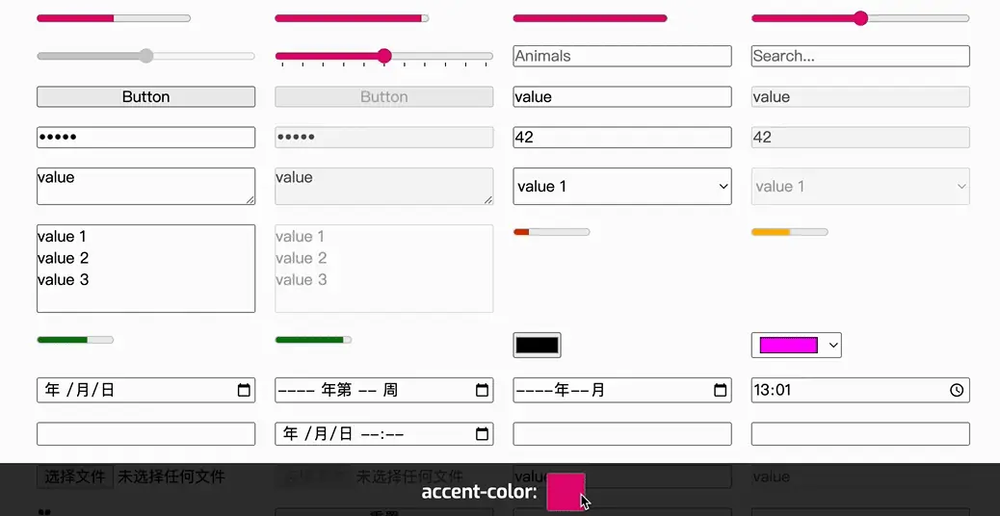

> Demo 地址：<https://codepen.io/airen/full/poxBMaL>

## color-scheme 的简介

前面在介绍 `accent-color` 属性的时候提到过，在 CSS 中可以将 `accent-color` 与 `color-scheme` 属性结合起来，在不同模式下（比如暗黑模式）给表单控件设置不同的着重色。而这个 `color-scheme` 属性是 [CSS 颜色调整模块 Level1](https://www.w3.org/TR/css-color-adjust-1/) 规范引入一个新特性。它通过用户代理控制自动颜色调整，目的是处理用户偏好（例如暗黑模式）、对比度调整或特定的所需的配色方案。

通过其中定义的 `color-scheme` 属性，元素可以指示它适合渲染的颜色方案。将这些值与用户的偏好进行协调，从而生成影响用户界面（UI）事物的所选配色方案（例如表单控件和滚动条的默认颜色），以及 CSS 系统颜色的使用值。

CSS 的 `color-scheme` 属性主要有三个值：

*   *`normal`* 表示元素完全不知道配色方案，因此应该使用浏览器的默认配色方案呈现该元素；
*   *`[light | dark]+`* 表示元素知道且可以处理列出的配色方案，并表达它们之间的排序偏好；
*   `only` 禁止用户代理覆盖元素的颜色方案。

在 CSS 中，`color-scheme` 属性可以用于单个元素级别，也可以用于 `:root` 级别。在 `:root` 元素上，使用配色方案渲染不仅会影响画布的表面颜色（即全局背景颜色）、`color` 属性的初始值以及系统颜色的使用值，还会影响视区的滚动条、拼写检查下划线和表单控件等。

比如前面示例中就有 `color-scheme` 的身影：

```CSS
:root {
    color-scheme: dark light;
}
```

## color-scheme 的使用

在 CSS 中，使用 `color-scheme` 主要有两种方式。

*   与 CSS 的媒体查询 `prefers-color-scheme` 一起使用。
*   与 HTML 的 `<meta>` 标签一起使用。

我们先来看第一种方式。

### 与 prefers-color-scheme 结合在一起

我们可以通过 CSS 的媒体查询 `@media` 来查询用户偏好的设置。最为经典的就是暗黑模式，我们可以通过以 `prefers-color-scheme` 为条件，给 Web 应用或页面在不同模式中设置不一样的样式风格。例如：

```CSS
/* 亮色模式 */
:root {
    --text-color: black;
    --bg-color: white;
}

body {
    color: var(--text-color);
    background-color: var(--bg-color);
}

@media (prefers-color-scheme: dark) {
    :root {
        --text-color: white;
        --bg-color: black;
    }
}
```

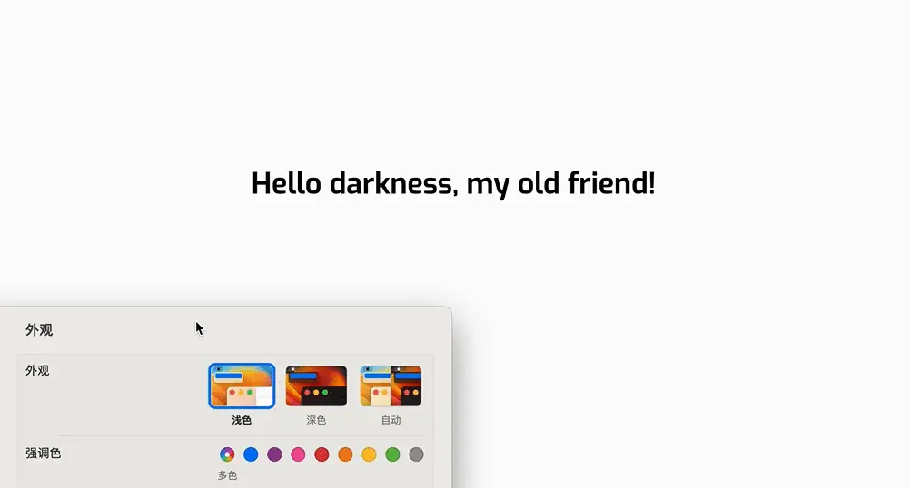

> Demo 地址：<https://codepen.io/airen/full/yLRWLNN>

上面示例所展示的是一个最简单的暗黑模式，它并不完美。如果在上面示例基础上增加一个文本链接（`<a>`），你会发现，当用户从亮色模式切换到暗色模式下时，文本链接的颜色可读性不符合 Web 可访问性要求。

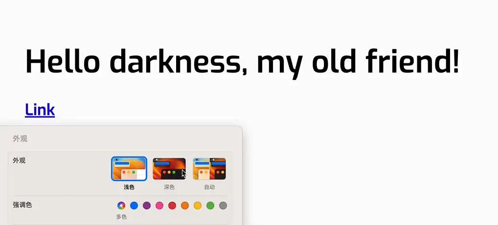

这是因为文本链接（`<a>`）是专有 WebKit CSS 颜色，即 `-webkit-link` （由 WebKit 和 Chrome 用于经典蓝色链接 `rgb(0 0 238)`）在黑色背景上的对比度不足 `2.23:1` ，并且不满足 [WCAG AA](https://webaim.org/resources/contrastchecker/?fcolor=0000EE\&bcolor=000000) 以及 [WCAG AAA](https://www.w3.org/WAI/WCAG21/Understanding/conformance#levels) 要求。

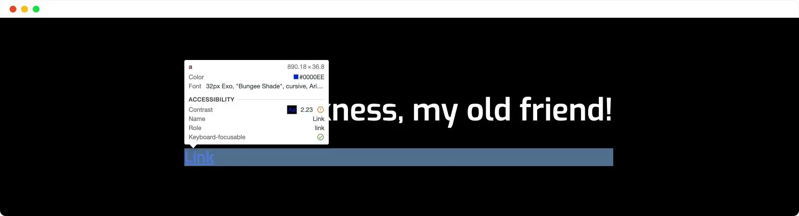

为了避免此现象出现，一般情况下应该将 `color-scheme` 与 `prefers-color-scheme` 结合起来。例如：

```CSS
/* 亮色模式 */
:root {
    --text-color: black;
    --bg-color: white;
    color-scheme: dark light;
}

body {
    color: var(--text-color);
    background-color: var(--bg-color);
}

@media (prefers-color-scheme: dark) {
    :root {
        --text-color: white;
        --bg-color: black;
    }
}
```

你发现，像文本链接这样的元素，即使切换到暗色模式下，它的可读性也很友好，符合 WCAG AAA 的标准。

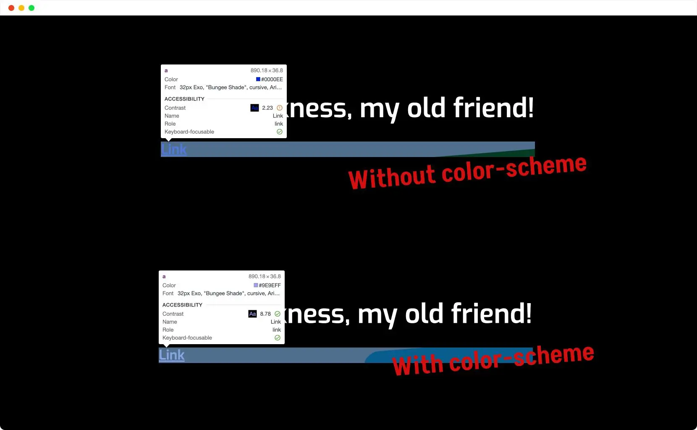

> Demo 地址：<https://codepen.io/airen/full/eYPaYzd>

其主要原因是，**`color-scheme`** **完全决定了默认的外观，而** **`prefers-color-scheme`** **则决定了可样式化的外观**。

### 与 meta 标签结合使用

`color-scheme` 还有一种使用方式是和 HTML 的 `<meta>` 标签结合，即：

```HTML
<meta name="color-scheme" content="dark light">
```

这样就可以帮助用户代理立即使用所需配色方案呈现页面背景，还可以提供 `color-scheme` 值，即 `content` 的值。

### 与 prefers-color-scheme 相互影响

虽然 `<meta>` 元标签和 CSS 属性（如果运用于 `:root{}` 根元素上）最终产生的效果相同（渲染行为相同），但我还是建议你在实际开发中使用 `<meta>` 标签来指定主题颜色配色方案，这样浏览器就可以更快地采用首选方案。

简单地说，它们在一起配合得非常好。这是因为 **`color-scheme` 完全决定了默认的外观，而** **`prefers-color-scheme`** **则决定了可样式化的外观**。比如下面这个示例：

```HTML
<html>
    <head>
        <meta name="color-scheme" content="dark light" />
    </head>
    <body>
        <p> Lorem ipsum dolor sit amet, legere ancillae ne vis.</p>
        <form>
            <fieldset>
                <legend>Lorem ipsum</legend>
                <button type="button">Lorem ipsum</button>
            </fieldset>
        </form>
    </body>
</html>
```

```CSS
fieldset {
    background-color: gainsboro;
}

@media (prefers-color-scheme: dark) {
    fieldset {
        background-color: darkslategray;
    }
}
```

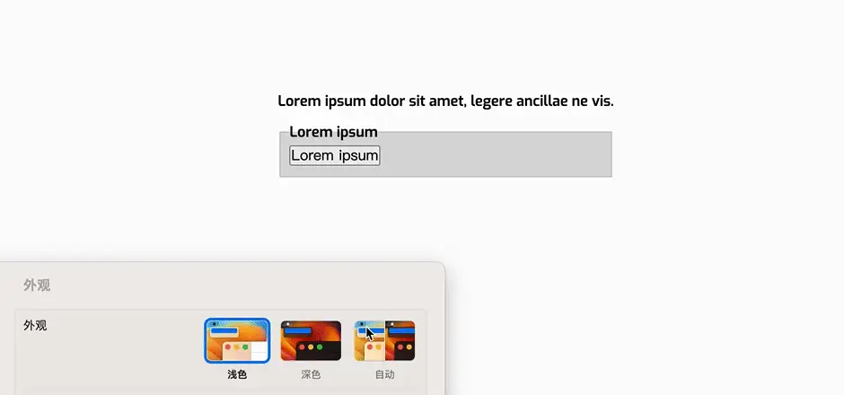

> Demo 地址：<https://codepen.io/airen/full/RwemNWb>

正如你所看到的，在亮色模式下 `<fieldset>` 元素的背景颜色是 `gainsboro` ，切换到暗色模式下时，该元素的背景色则变成 `darkslategray` 。

在上面这个示例中，通过 `<meta name="color-scheme" content="dark light">` 元素，页面会告知浏览器它支持深色和浅色主题，且优先选择深色主题。

整个页面的效果根据操作系统的设置变化，如果系统被设置为深色模式，那么整个页面会基于用户代理样式表在深色中显示浅色；如果系统被设置为亮色模式，那么整个页面会基于用户代理样式表在亮色中显示深色。无需其他开发人员提供的 CSS 来更改页面的段落文本或背景颜色。

请注意，`<fieldset>` 元素的 `background-color` 根据是否启用深色模式而更改，遵循页面上开发人员提供的样式规则。具体为 `gainsboro` 或 `darkslategray`。

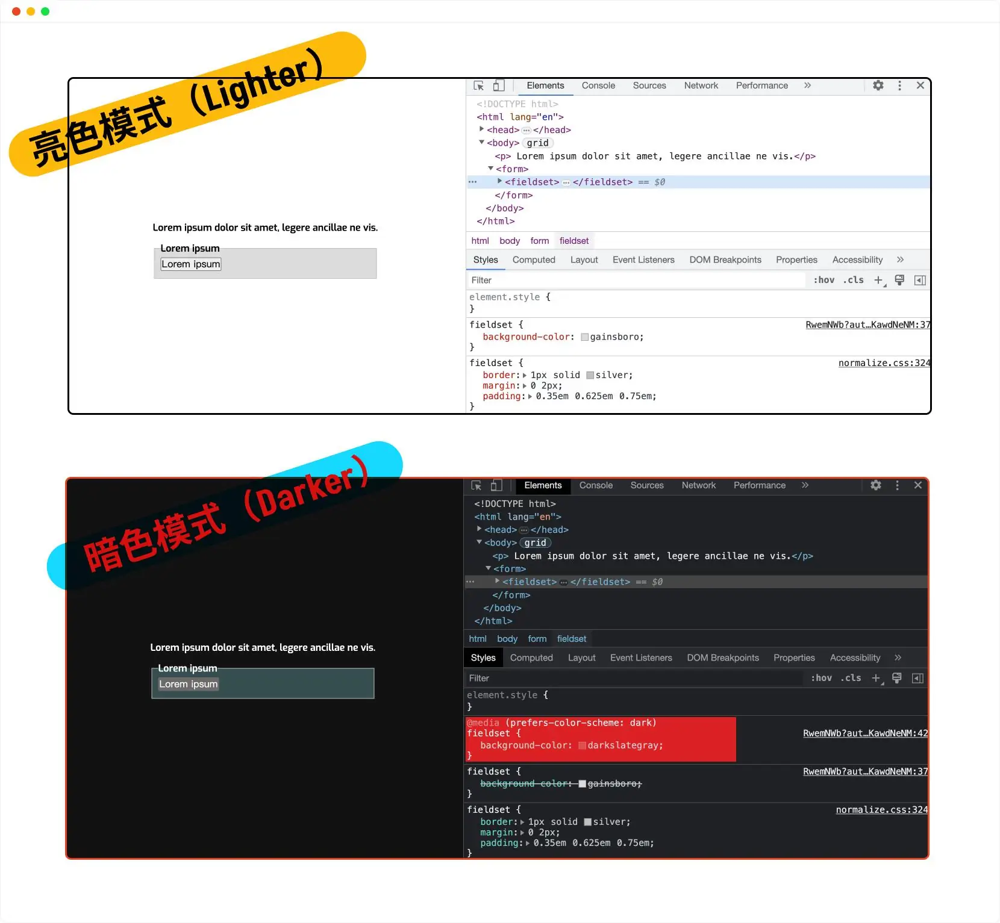

正如你所看到的：

*   **亮色模式（Lighter）：** 由开发人员和用户代理（比如浏览器）指定的样式。按照用户代理样式表，文本为黑色，背景为白色。按照开发人员提供的样式规则，`<fieldset>` 元素的 `background-color` 为 `gainsboro`
*   **深色模式（Darker）：** 由开发人员和用户代理（比如浏览器）指定的样式。按照用户代理样式表，文本为白色，背景为黑色。按照开发人员提供的样式规则，`<fieldset>` 元素的 `background-color` 为 `darkslategray`

在上面这个示例中，Web 开发者仅仅调整了 `<fieldset>` 元素的背景颜色（`background-color`），该元素其他样式规则并未做任何调整，以及其他元素也未做任何样式的调整，比如 `<button>` 元素和 `<p>` 元素。或许你已经发现了，即使开发者并没有显式对 `<p>` 和 `<button>` 元素做任何样式的设置，但它们在不同模式下，样式仍然会自动切换。

就拿按钮 `<button>` 为例吧，`<button>` 元素的外观由用户代理样式表控制。如下图所示：

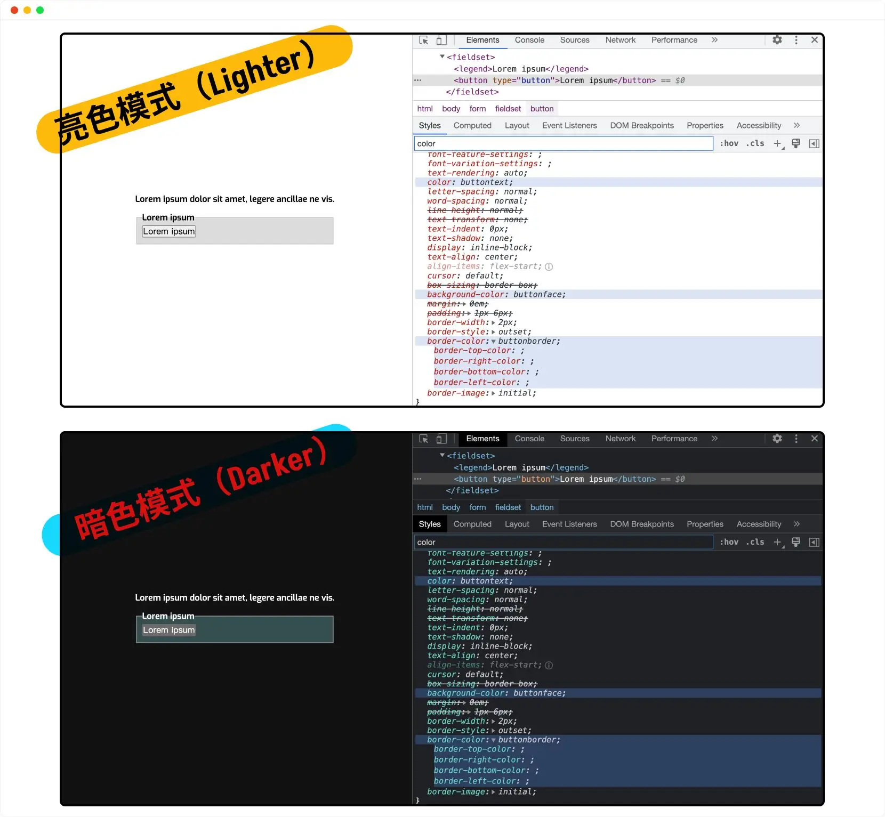

不难发现，不管是亮色模式还是暗色模式下，按钮（`<button>`）的背景颜色（`background-color`）都是 `ButtonFace` 、文本颜色（`color`）是 `ButtonText` 以及边框颜色（`border-color`）是 `ButtonBorder` 。不同的是，在不同模式之下，它们的计算值有所差别。

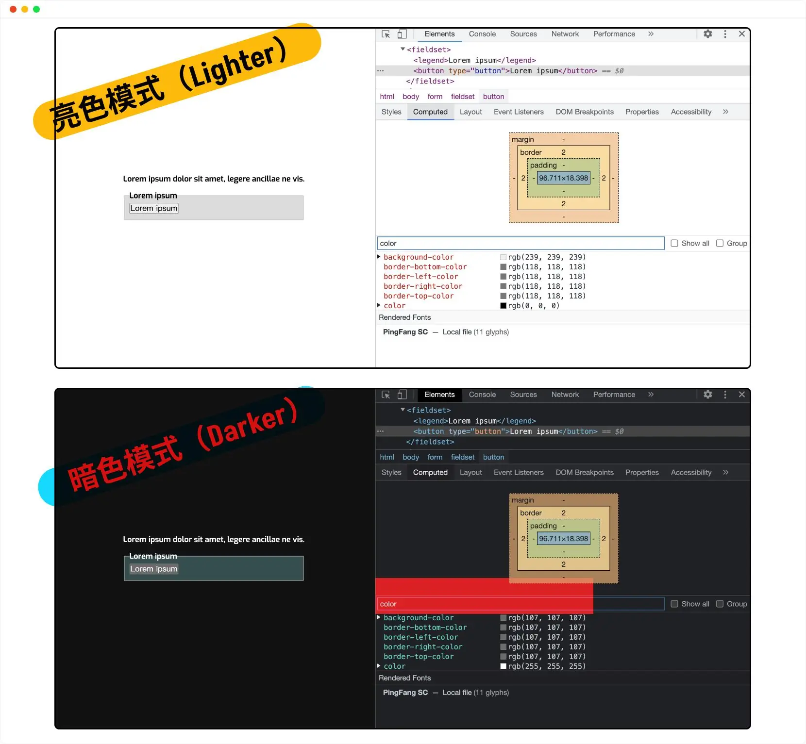

在亮色模式下：

*   `ButtonFace` 的计算值是 `rgb(239 239 239)` ；
*   `ButtonText` 的计算值是 `rgb(0 0 0)` ；
*   `ButtonBorder` 的计算值是 `rgb(118 118 118)` 。

而在暗色模式下：

*   `ButtonFace` 的计算值是 `rgb(107 107 107)`；
*   `ButtonText` 的计算值是 `rgb(107 107 107)` ；
*   `ButtonBorder` 的计算值是 `rgb(255 255 255)` 。

有一点需要注意的是，CSS 的系统颜色在不同的客户端中，其计算值也有所差异，比如上面示例中的 `ButtonFace` 、`ButtonBorder` 和 `ButtonText` ，在 Safari 中计算与 Chrome 中计算值就不同。

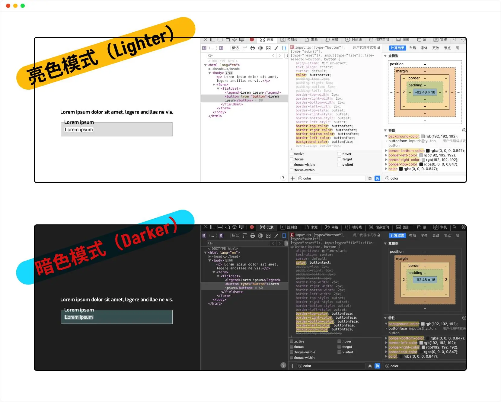

而且运用于元素的不同属性的值也会有所差异。比如，在 Safari 浏览器中，元素 `<button>` 的 `background-color` 和 `border-color` 都是 `ButtonFace` 。更为有意思的是，同样用于 `border-color` 的 `ButtonFace` ，其计算值也有所差异。比如，计算值（针对 `border-top-color` 和 `border-bottom-color`）从 `rgba(0, 0, 0, 0.847)`（偏黑色）切换为 `rgba(255, 255, 255, 0.847)`（偏白色），因为用户代理会根据配色方案动态更新 `ButtonFace`。

这也就是前面示例中，文本链接 `<a>` 元素，在不设置 `color-scheme` 时，暗黑模式下阅读困难的原因所在。也就是说，当你在 CSS 中未显式地为每种模式下文档设置颜色时，浏览器（客户端）会替你设置一个。这也意味着我们需要在浅色背景上获得深色文本（亮色模式），在深色背景上获得浅色文本（暗色模式）。即：

```HTML
<meta name="color-scheme" content="dark light">
```

```CSS
:root { 
    color-scheme: light dark;
} 
```

注意，最好这两者结合起来一起使用。这样做的最大优势就是**不需要挑选或定义任何颜色（为不同模式）**。用户代理（你的浏览器）样式表会帮助我们处理这些细节。因此，用户得到的调色板更接近于他们在操作系统中使用其他本地应用程序的体验。

比如[ @Chris Coyier 在 Codepen 上向大家展示的示例](https://codepen.io/chriscoyier/full/OJpKgBe)：

```CSS
html { 
    color-scheme: light dark; 
} 

body { 
    background: Canvas; 
    font: 100%/1.4 system-ui; 
} 

.card { 
    border: 5px solid LinkText; 
} 

h3 { 
    background: ButtonFace; 
    color: ButtonText; 
    border-bottom: 10px solid VisitedText; 
} 

p { 
    font-family: ui-monospace, system-ui; 
} 

.button { 
    background: ActiveText; 
    color: Field; 
} 

footer { 
    background: Highlight; 
} 
```

切换你的系统设置，可以看到下面这样的效果：

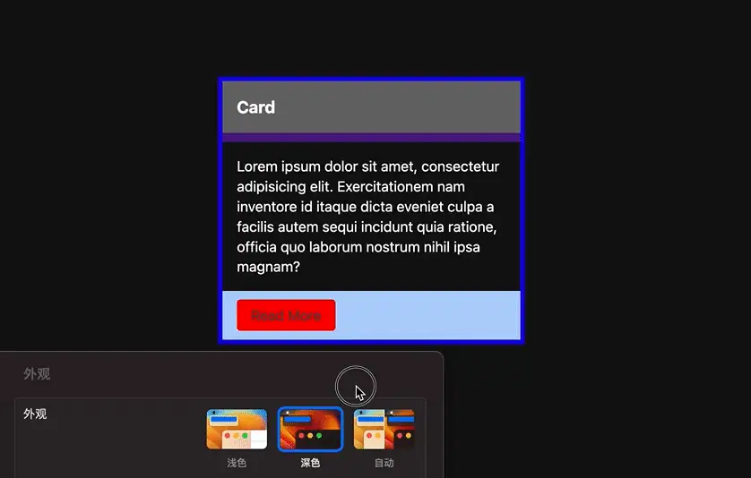

> Demo 地址：<https://codepen.io/airen/full/RwemNzo>

## 案例：美化表单样式

现在，我们已经知道了，使用 CSS 的 `accent-color` 和 `color-scheme` 属性，可以高效利用用户代理样式，使得把我们的品牌颜色快速而轻松地应用于某些表单控件（例如，单选按钮、复选框等）变得容易。接下来，我们一起来看看，这两个属性如何实现简单、易于访问的复选框和单选按钮。

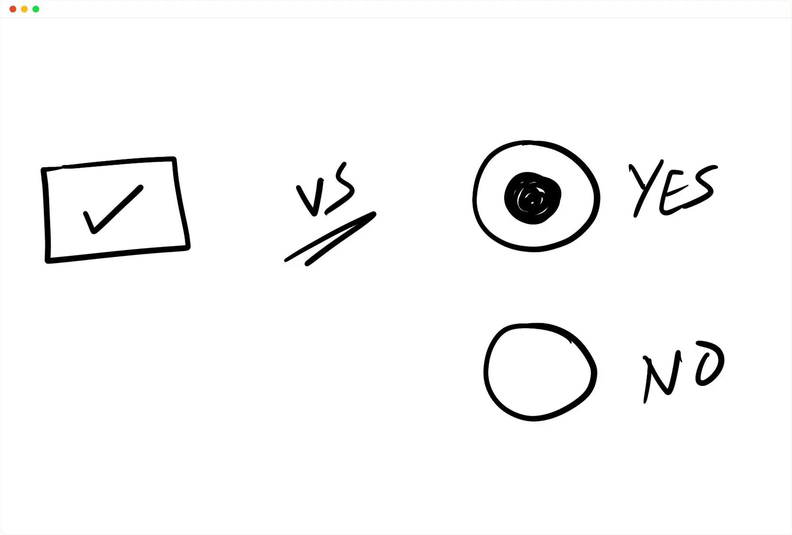

大多数情况下，Web 开发者都会采用一些 Hack 手段给复选框或单选按钮自定义样式，比如将筛选框、单选按钮隐藏起来，再使用伪元素来模拟它们，就像下面这样：

```HTML
<form>
    <fieldset>
        <legend>选择你喜欢的语言</legend>
        <div class="control">
            <input type="checkbox" id="html" name="lange" />
            <label for="html">HTML</label>
        </div>
        <div class="control">
            <input type="checkbox" id="css" name="lange" checked />
            <label for="css">CSS</label>
        </div>
        <!-- 省略其他复选框 -->
    </fieldset>
    <fieldset>
        <legend>选择你最喜欢的框架</legend>
        <div class="control">
            <input type="radio" name="frameworks" id="bootstrap">
            <label for="bootstrap">Bootstrap</label>
        </div>
        <div class="control">
            <input type="radio" name="frameworks" id="bulma">
            <label for="bulma">Bulma</label>
        </div>
        <!-- 省略其他单选按钮 -->
    </fieldset>
</form>
```

```CSS
fieldset input {
    clip: rect(0 0 0 0);
    clip-path: inset(50%);
    height: 1px;
    overflow: hidden;
    position: absolute;
    white-space: nowrap;
    width: 1px;
}

fieldset label {
    display: flex;
    align-items: center;
    gap: 10px;
    cursor: pointer;
    transition: all .2s linear;
}

fieldset label::before {
    content: "";
    width: 2rem;
    aspect-ratio: 1;
    border: 2px solid #fff;
    display: inline-flex;
    border-radius: 3px;
    justify-content: center;
    align-items: center;
    transition: all .2s linear;
}

fieldset:has(input[type="radio"]) label::before {
    border-radius: 50%;
}

input:checked ~ label {
    color: var(--brand);
}

input[type="checkbox"]:checked ~ label::before {
    content: "✓";
    background-color: var(--brand);
    border-color: var(--brand);
    color: #fff;
}

input[type="radio"]:checked ~ label::before {
    content: "✣";
    background-color: var(--brand);
    border-color: var(--brand);
    box-shadow: inset 0 0 0 4px #fff;
    color: #fff;
}
```

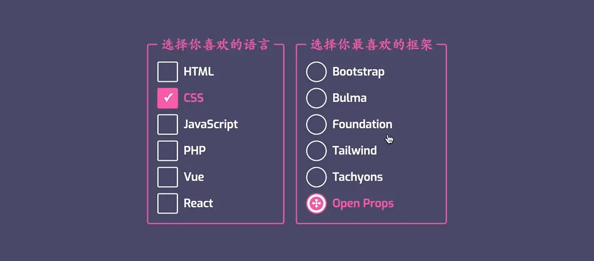

> Demo 地址：<https://codepen.io/airen/full/vYVwJwG>

这种技术可以跨浏览器使用，而且在某些效果下，这种技术仍然是必需的，例如完全自定义复选框或单选按钮（包括动画等）。但许多情况下，我们不需要任何花哨的样式，只需要将品牌色运用于表单控件（例如，示例中的复选框和单选按钮）上。如此一来，我们就可以摆脱那些笨重的 CSS，是不是很棒？这就是 `accent-color` 的用处！

```CSS
:root {
    --brand: hotpink;
}

fieldset input {
    width: 2rem;
    aspect-ratio: 1;
    accent-color: var(--brand);
}
```

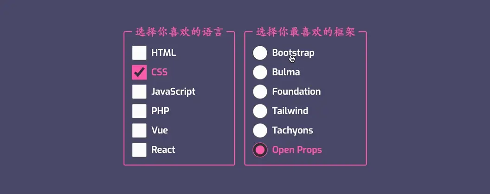

> Demo 地址：<https://codepen.io/airen/full/YzJbrPW>

在此基础上，引入 CSS 自定义属性，我们还可以创建一些有趣的效果。比如下面这个示例，给每个复选框和单选按钮组分配一个自定义属性，该属性对应元素的索引（`--i`），并使用 HTML 中的 `style` 属性进行设置。然后，我们使用它在 CSS 中计算 HSL 颜色函数中的色相值，以确定 `accent-color` 属性的值。

```HTML
<form>
    <fieldset>
        <legend>选择你喜欢的语言</legend>
        <div class="control" style="--i: 1;">
            <input type="checkbox" id="html" name="lange" />
            <label for="html">HTML</label>
        </div>
        <div class="control" style="--i: 2;">
            <input type="checkbox" id="css" name="lange" checked />
            <label for="css">CSS</label>
        </div>
        <!-- 省略其他复选框 -->
    </fieldset>
    <fieldset>
        <legend>选择你最喜欢的框架</legend>
        <div class="control" style="--i: 1;">
            <input type="radio" name="frameworks" id="bootstrap">
            <label for="bootstrap">Bootstrap</label>
        </div>
        <div class="control" style="--i: 2;">
            <input type="radio" name="frameworks" id="bulma">
            <label for="bulma">Bulma</label>
        </div>
        <!-- 省略其他单选按钮 -->
    </fieldset>
</form>
```

```CSS
.control {
    --hue: calc(var(--i) * 30deg + 150deg);
    --accent-color: hsl(var(--hue, 0), 80%, 50%);
    accent-color: var(--accent-color);
}
```

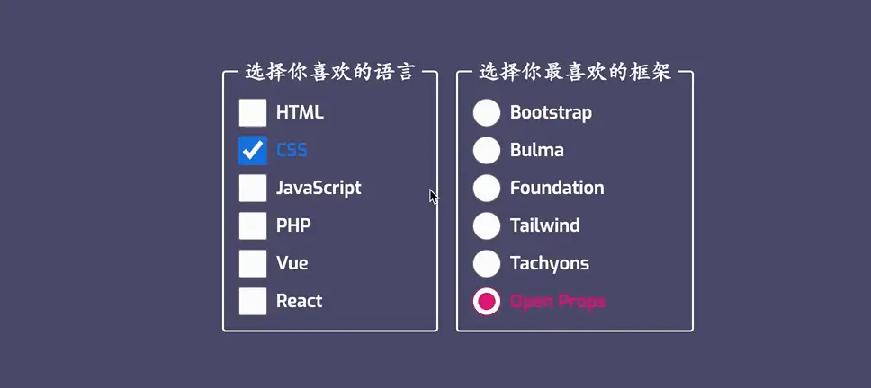

> Demo 地址：<https://codepen.io/airen/full/rNqgGxb>

你还可以使用 CSS 的相对颜色来实现上面示例所展示的效果：

```CSS
:root {
    --brand: hotpink;
}

.control {
    --accent-color: hsl(from var(--brand) calc(var(--i) * 30deg + 150deg) s l);
    accent-color: var(--accent-color);
}
```

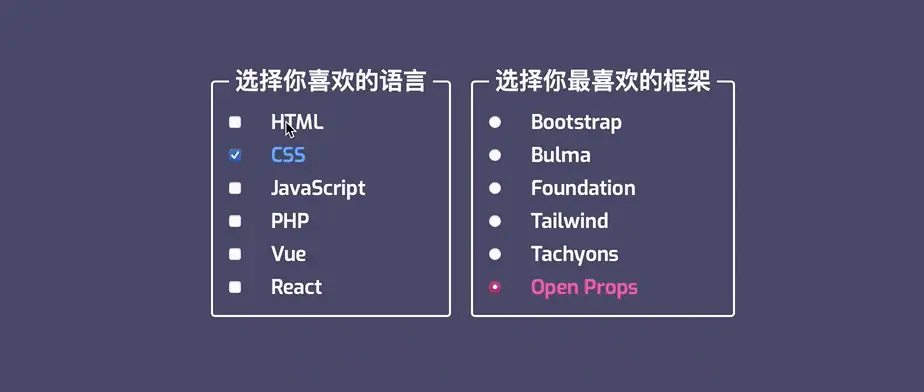

> Demo 地址：<https://codepen.io/airen/full/wvYbrWp> （请使用 Safari 查看 Demo）

看上去似乎 OK！但还有一个细节请大家不要遗忘。那就是 `color-scheme` ，尤其是你的表单被运用于多种模式下，比如暗黑模式中，`color-scheme` 属性可以帮助我们根据用户对亮色或深色模式的偏好进行样式设计。

```HTML
<meta name="color-scheme" content="light dark">
```

```CSS
:root {
    --bg: white;
    --color: black;
    --brand: hotpink;
    color-scheme: light dark;
}

body {
    background-color: var(--bg);
    color: var(--color);
}

@media (prefers-color-scheme: dark) {
    :root {
        --bg: black;
        --color: white;
        color-scheme: dark;
    }
}

@supports (hsl(from var(--brand) 30deg l s)) {
    .control {
        --accent-color: hsl(from var(--brand) calc(var(--i) * 30deg + 150deg) s l);
        accent-color: var(--accent-color);
    }
  
    @media (prefers-color-scheme: dark) {
        .control {
            --accent-color: hsl(from var(--brand) calc(var(--i) * 30deg + 150deg) 80% 80%);
        }
    }
}

@supports not (hls(from var(--brand) 30deg l s)) {
    .control {
        --hue: calc(var(--i) * 30deg + 150deg);
        accent-color: hsl(var(--hue, 0), 80%, 50%);
    }

    @media (prefers-color-scheme: dark) {
        .control {
            color: hsl(var(--hue, 0), 80%, 80%);
        }
    }
}
```

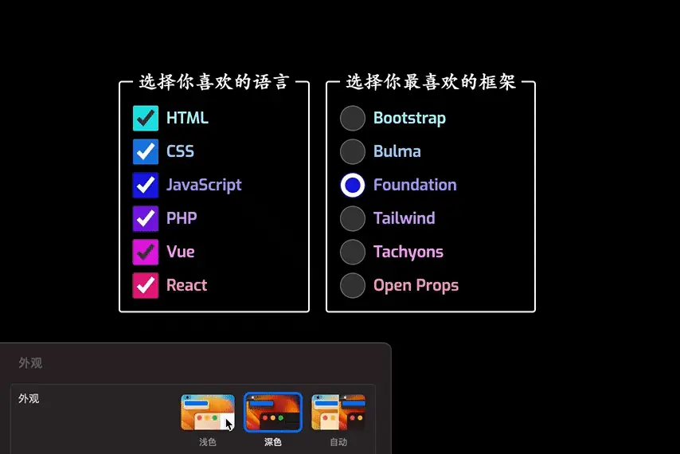

> Demo 地址：<https://codepen.io/airen/full/poxmWPq>

这样就完美了！

在这里，我们主要谈到了复选框和单选按钮，因为它们是最常见的需要自定义的表单元素之一。但是 `accent-color` 具有为许多表单元素提供快速简便样式的潜力，特别是在不需要进行广泛自定义的情况下，同时允许浏览器选择最佳的可访问选项。

## 小结

目前，`accent-color` 只能运用于复选框、单选按钮、进度条和滑块四个元素上。不过，`accent-color` 只能样式化这四个元素的着重色，但不允许完全自定义样式。如果你需要完全自定义本地控件，那还是需要采用一些额外的技术手段，比如使用伪元素模拟表单控件。

虽然目前只有复选框、单选按钮、进度条和滑块四个元素受益于 `accent-color` 属性，但并不代表以后也只有这四个元素受益于 `accent-color` 。也就是说，以后可能会有更多的 Web 控件受益于 `accent-color`。例如，`<select>` 中选定的 `<option>` 等元素可以采用 `accent-color` 突出显示。

除此之外，我们的 Web 控件会用于不同的模式之中，比如亮色模式或暗色模式下。为了确保它在不同的模式下都能有一个完美的 UI 效果，我们还需要考虑使用 `color-scheme` 属性，使客户端（比如浏览器）能在相应模式下自动匹配系统颜色。这样做的好处除了使 Web 控件 UI 更美观之外，还能使其更具可访问性。
